# Agent Orchestration Architecture

This document details Stravinsky's agent spawning and orchestration patterns for parallel execution.

## Overview

Stravinsky implements an **Enforced Parallelism** pattern inspired by oh-my-opencode. It uses native Claude Code subagents with automatic delegation to external models via MCP tools.

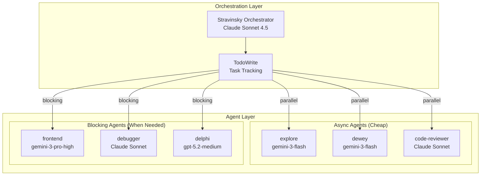

## Agent Types

### Agent Characteristics

| Agent | Model | Cost | Mode | Trigger |
|-------|-------|------|------|---------|
| **stravinsky** | Sonnet 4.5 (32k thinking) | Moderate | Primary | `/strav` command |
| **explore** | gemini-3-flash | Free | Async | Code search queries |
| **dewey** | gemini-3-flash | Cheap | Async | Documentation research |
| **code-reviewer** | Claude Sonnet | Cheap | Async | Quality analysis |
| **frontend** | gemini-3-pro-high | Medium | Blocking | ALL visual changes |
| **debugger** | Claude Sonnet | Medium | Blocking | After 2+ failures |
| **delphi** | gpt-5.2-medium | Expensive | Blocking | Architecture, 3+ failures |

### Cost Optimization Strategy

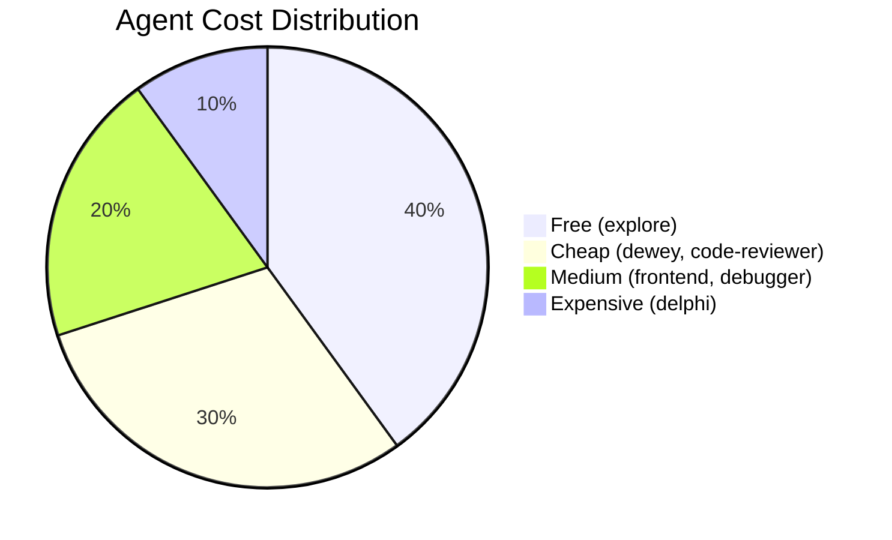

**Principle**: Use the cheapest agent that can complete the task.

## Parallel Execution Pattern

### Correct Pattern

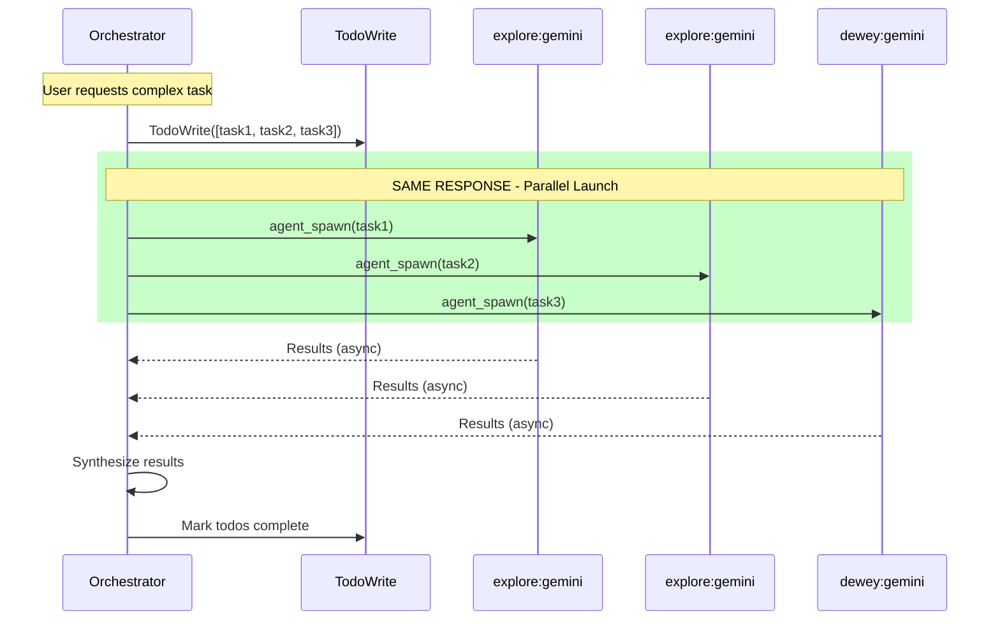

### Anti-Pattern (Sequential)

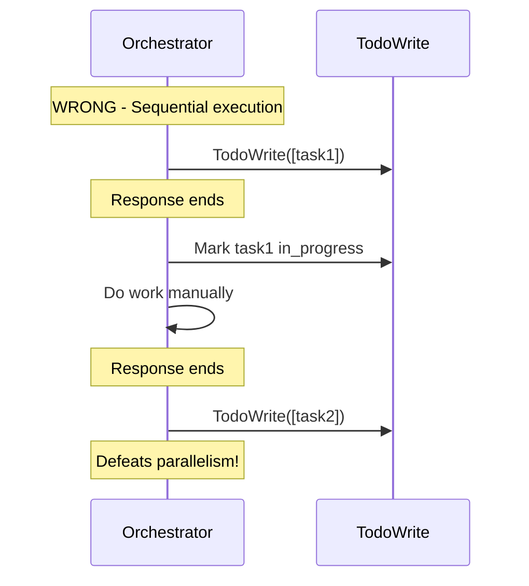

## Agent Spawn Flow

### spawn_agent() Implementation

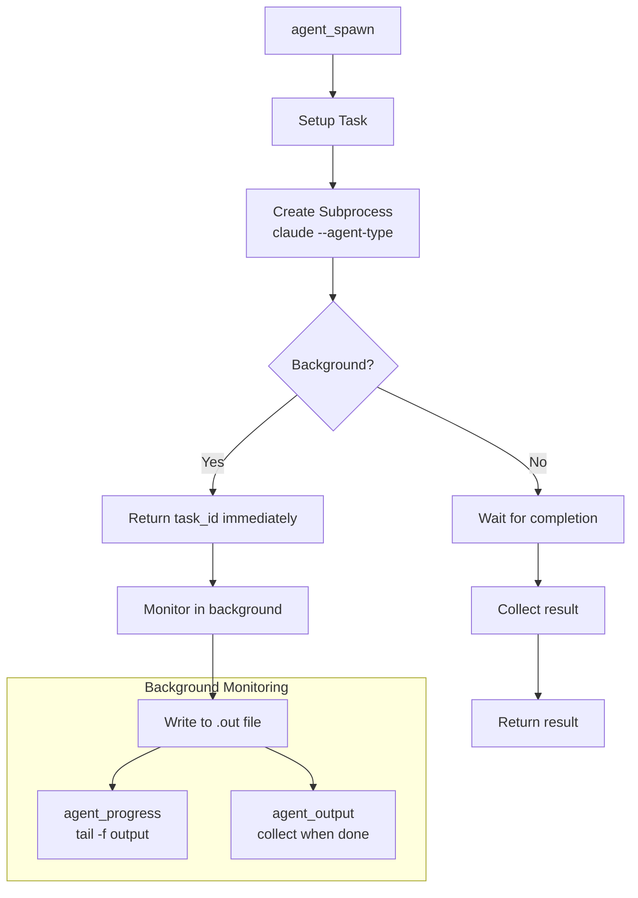

### Agent Execution Environment

```python
# Agent subprocess command
claude \
    --agent-type {agent_type} \
    --model haiku \  # Thin wrapper
    --prompt "..." \
    --mcp-tools invoke_gemini,grep_search,...

# Output captured to:
# ~/.stravinsky/agents/{task_id}.out
```

## Thin Wrapper Pattern

### Why Thin Wrappers?

Claude Code's `Task` system only supports Claude models. To access Gemini/GPT:

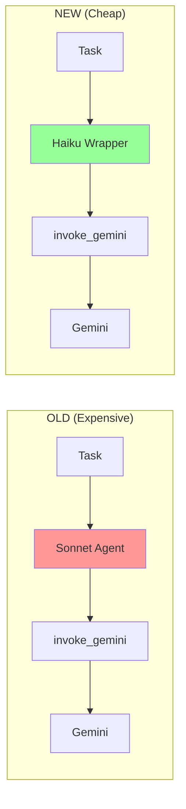

**Cost Savings**: ~10x cheaper on the Claude side.

### Wrapper Implementation

Each specialized agent's prompt instructs it to:

1. Parse the incoming task
2. Immediately call `invoke_gemini` or `invoke_openai`
3. Pass through the full context
4. Return the external model's response

```python
# explore agent prompt (simplified)
"""
You are an explore agent. For ALL tasks:
1. Call invoke_gemini with the search query
2. Return Gemini's response unchanged
Do NOT do any work yourself.
"""
```

## Delegation Rules

### When to Use Each Agent

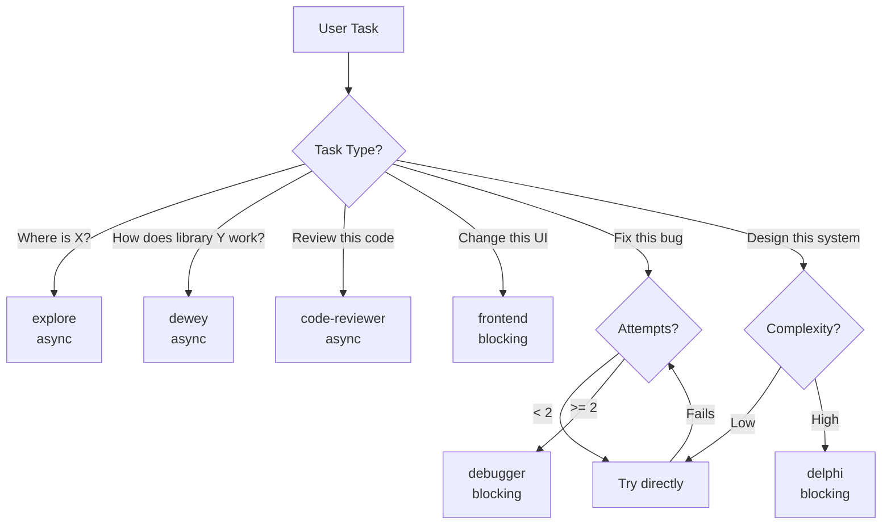

### Blocking vs Async

| Mode | Agents | When to Use |
|------|--------|-------------|
| **Async** | explore, dewey, code-reviewer | Research, search, review |
| **Blocking** | frontend, debugger, delphi | Must complete before next step |

## Hook-Based Enforcement

### PreToolUse Hooks

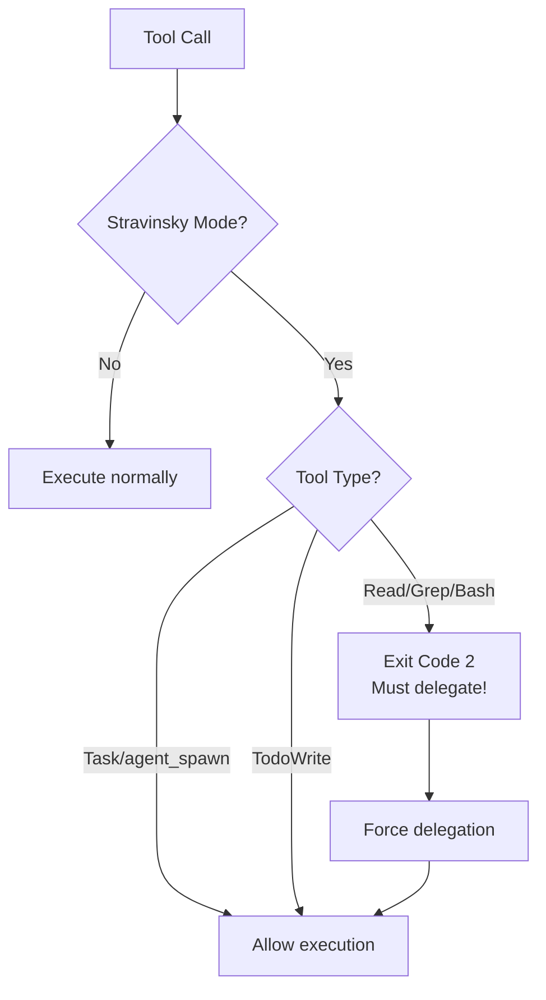

### Stravinsky Mode Marker

```bash
# Mode activated by orchestrator
touch ~/.stravinsky_mode

# Mode deactivated on completion
rm ~/.stravinsky_mode
```

When active, hooks block direct file operations, forcing delegation.

## Agent Output Collection

### Output Storage

```
~/.stravinsky/agents/
├── agent_abc123.out     # stdout/stderr
├── agent_abc123.status  # running/complete/failed
├── agent_def456.out
└── agent_def456.status
```

### Collection Flow

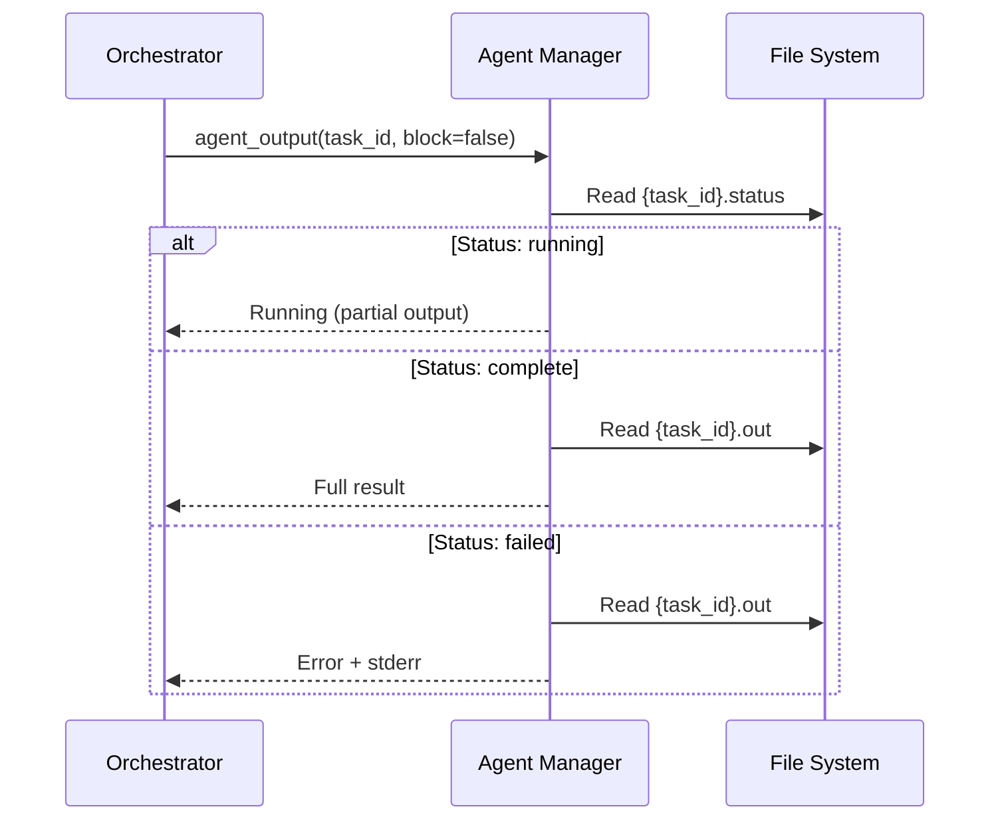

### Progress Monitoring

```python
# Real-time progress (like tail -f)
result = await agent_progress(task_id, lines=20)

# Block until complete
result = await agent_output(task_id, block=True)
```

## ULTRATHINK / IRONSTAR Modes

### ULTRATHINK

Extended thinking budget for complex reasoning:

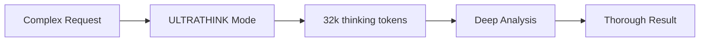

### IRONSTAR

Maximum parallel execution:

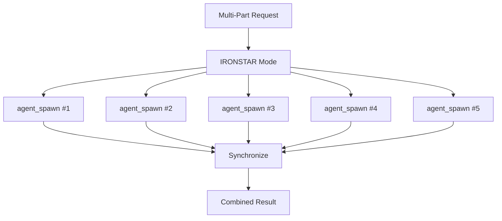

**Rule**: Launch ALL agents in ONE response. Don't wait.

## Error Handling

### Failed Agent Recovery

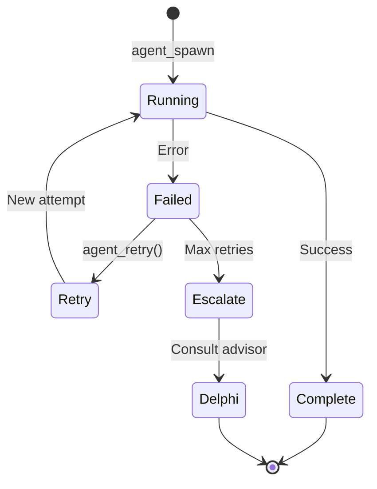

### Timeout Handling

```python
# Default timeout: 300 seconds (5 min)
# Can be customized per agent
result = await agent_spawn(
    prompt="...",
    timeout=600,  # 10 min for long tasks
    agent_type="explore"
)
```

## Best Practices

### Do's

- Fire all independent agents in ONE response
- Use cheapest agent that can do the job
- Mark todos complete immediately when done
- Use `agent_progress` for long-running tasks

### Don'ts

- Don't use `delphi` for simple searches (use `explore`)
- Don't block on async agents unnecessarily
- Don't forget to mark todos complete
- Don't spawn sequential agents across responses

## Related Documentation

- [Architecture Overview](ARCHITECTURE.md)
- [MCP Tool Flow](MCP_TOOL_FLOW.md)
- [Hooks System](HOOKS.md)
- [Agent Workflow](AGENT_WORKFLOW.md)
