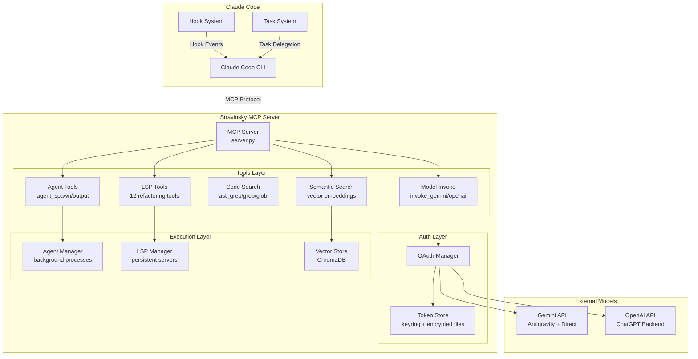
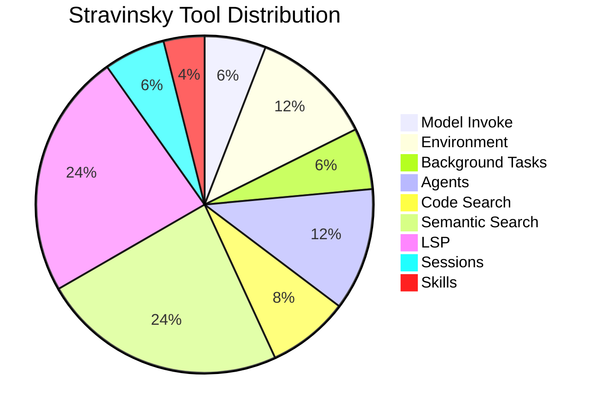
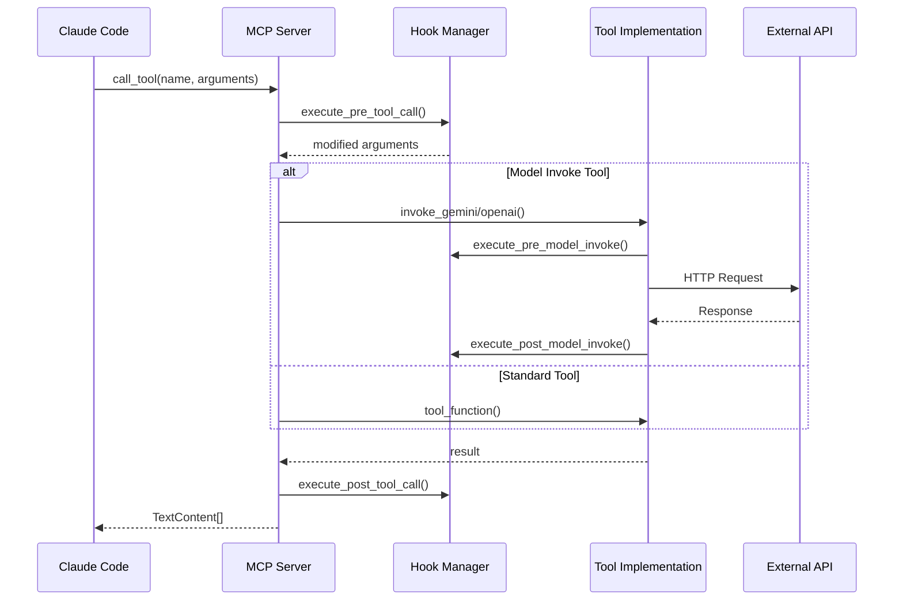
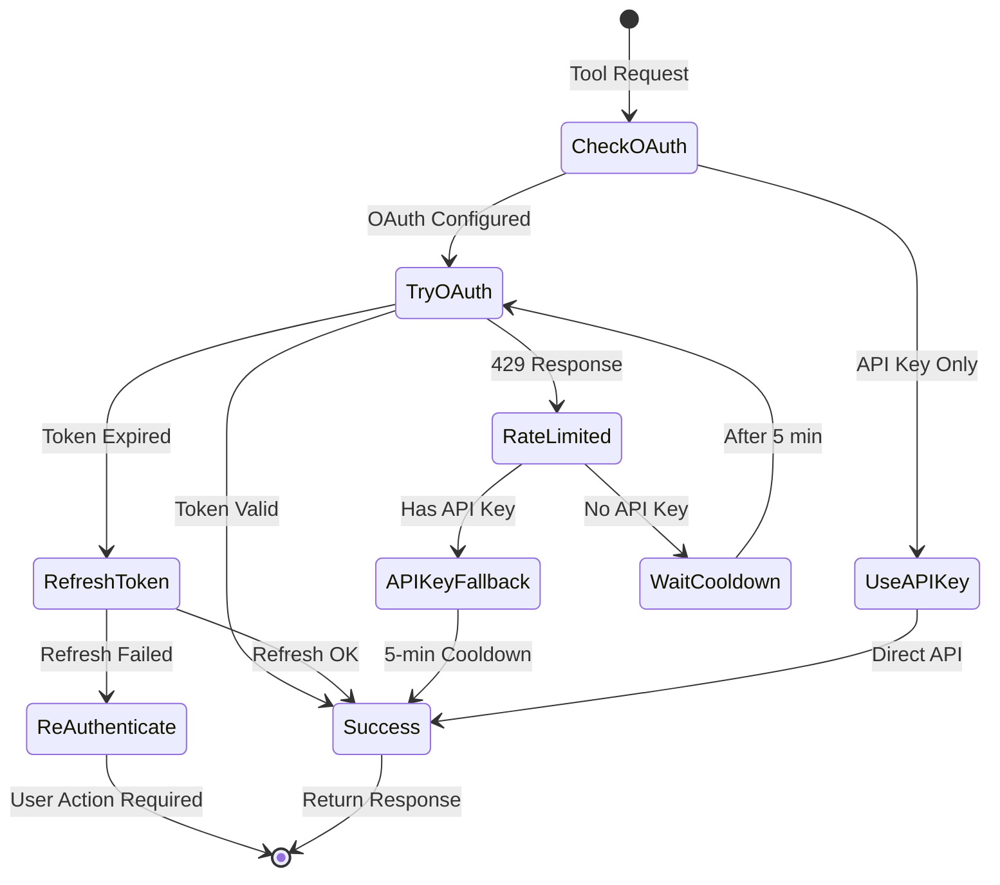
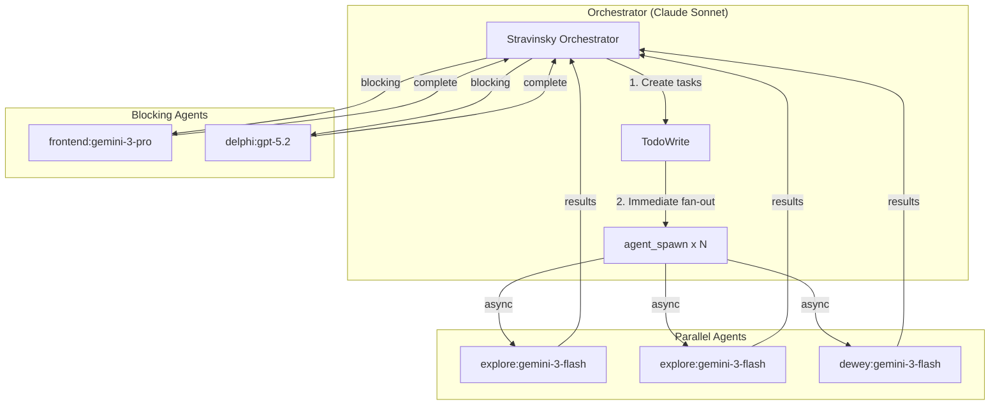
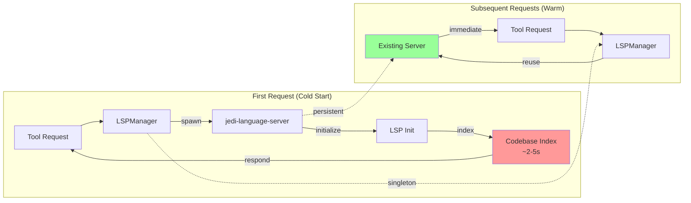
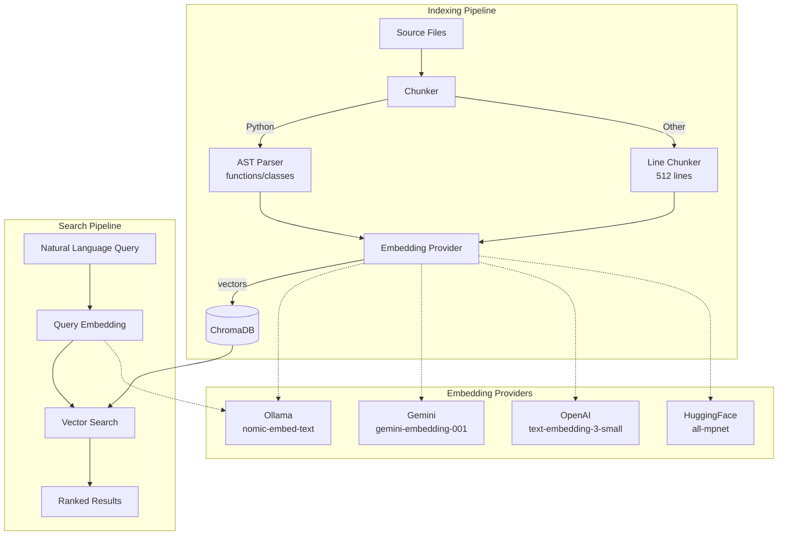
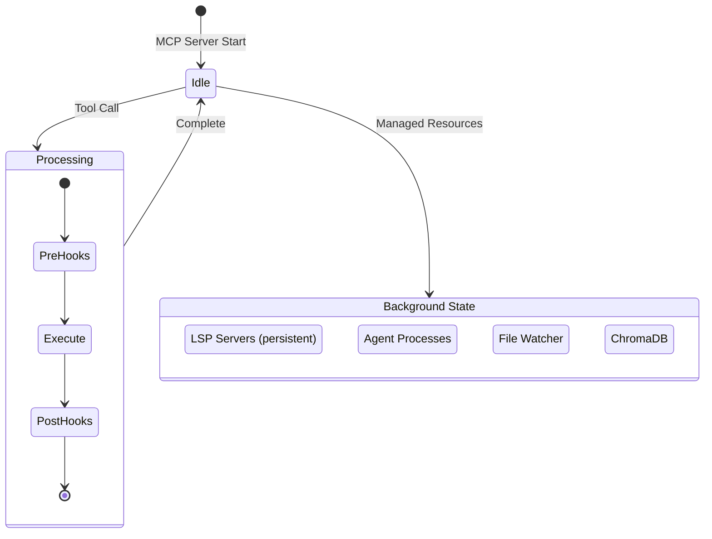
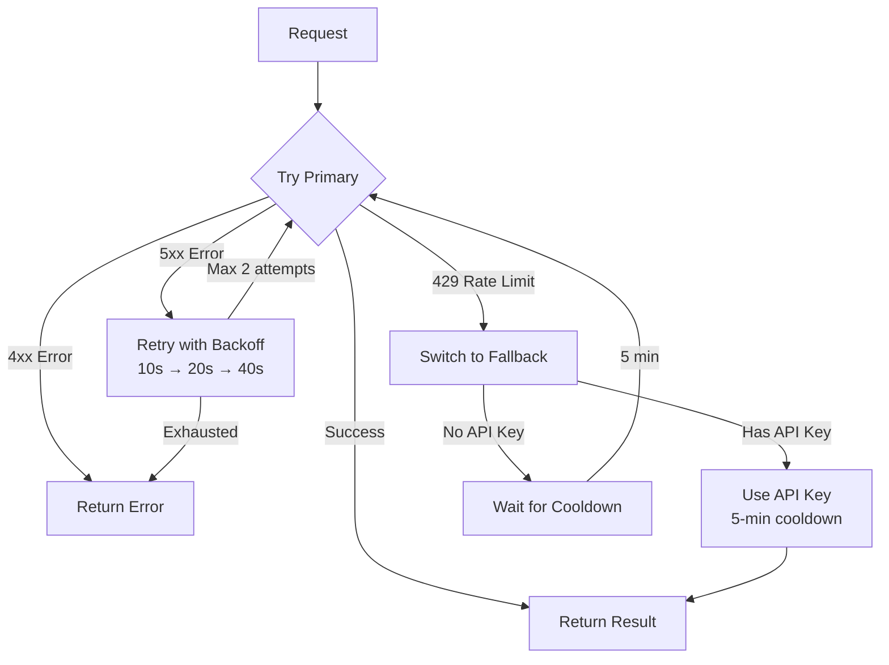
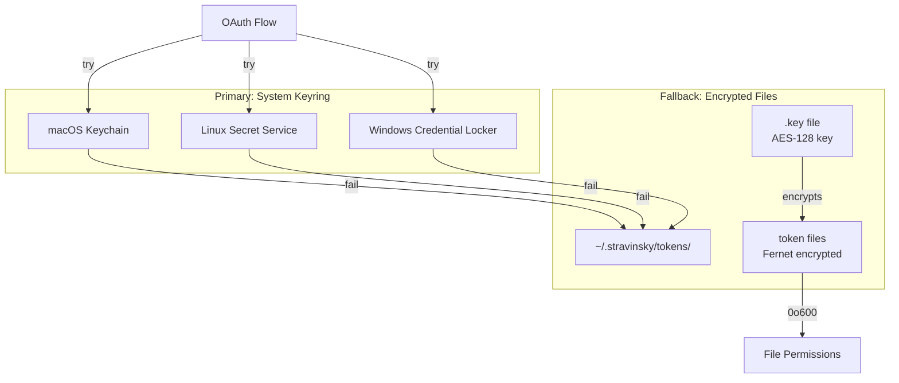

# Stravinsky Architecture

This document provides a comprehensive view of Stravinsky's architecture with detailed flow diagrams.

## System Overview

Stravinsky is an MCP (Model Context Protocol) server that extends Claude Code with multi-model orchestration, OAuth authentication, and specialized tooling.

## Component Architecture

### Core Components

| Component | Location | Purpose |
|-----------|----------|---------|
| **MCP Server** | `mcp_bridge/server.py` | Entry point, tool dispatch |
| **Tool Definitions** | `mcp_bridge/server_tools.py` | Tool metadata (47 tools) |
| **Model Invoke** | `mcp_bridge/tools/model_invoke.py` | Gemini/OpenAI integration |
| **Agent Manager** | `mcp_bridge/tools/agents/` | Background agent spawning |
| **LSP Manager** | `mcp_bridge/tools/lsp/manager.py` | Persistent LSP servers |
| **Semantic Search** | `mcp_bridge/tools/semantic_search/` | Vector embeddings |
| **OAuth** | `mcp_bridge/auth/` | Token management |

### Tool Categories (47 Total)

## Key Architectural Flows

### 1. MCP Tool Invocation Flow

### 2. OAuth Authentication Flow

### 3. Agent Orchestration Flow

### 4. LSP Persistence Architecture

### 5. Semantic Search Pipeline

## Performance Characteristics

### LSP 35x Speedup

| Metric | Cold Start | Warm Start | Improvement |
|--------|-----------|------------|-------------|
| Process startup | 100-200ms | 0ms | Eliminated |
| LSP initialization | 50-100ms | 0ms | Eliminated |
| Codebase indexing | 1-5s | 0ms | Eliminated |
| Request processing | 5-50ms | 5-50ms | Same |
| **Total** | **2-5s** | **5-50ms** | **35-400x** |

### Agent Cost Optimization

| Agent | Wrapper Model | External Model | Use Case |
|-------|---------------|----------------|----------|
| `explore` | Haiku | gemini-3-flash | Code search |
| `dewey` | Haiku | gemini-3-flash | Documentation |
| `frontend` | Haiku | gemini-3-pro | UI/UX |
| `delphi` | Haiku | gpt-5.2-medium | Architecture |

## State Management

## Error Handling Strategy

## Security Architecture

### Token Storage

## Related Documentation

- [OAuth Flow Details](OAUTH_FLOW.md)
- [MCP Tool Flow](MCP_TOOL_FLOW.md)
- [Agent Orchestration](AGENT_ORCHESTRATION.md)
- [LSP Architecture](LSP_ARCHITECTURE.md)
- [Semantic Search](SEMANTIC_SEARCH_QUICK_START.md)
- [Hooks System](HOOKS.md)
