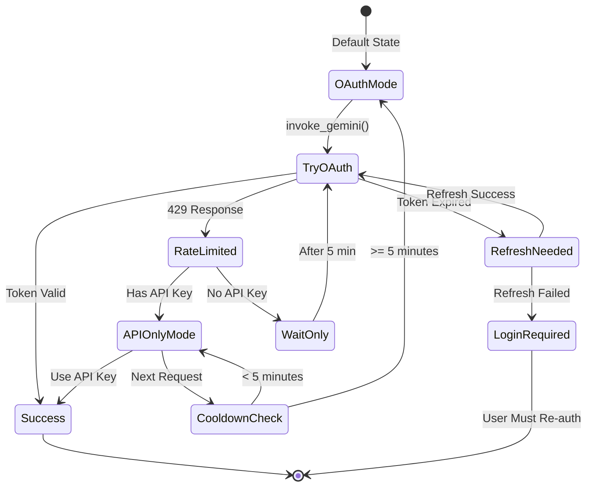
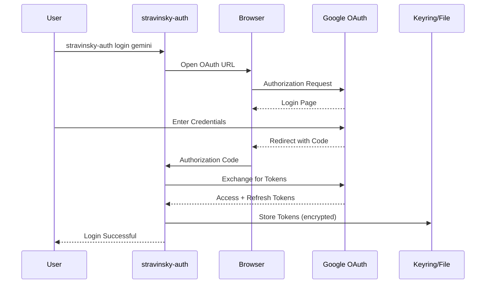
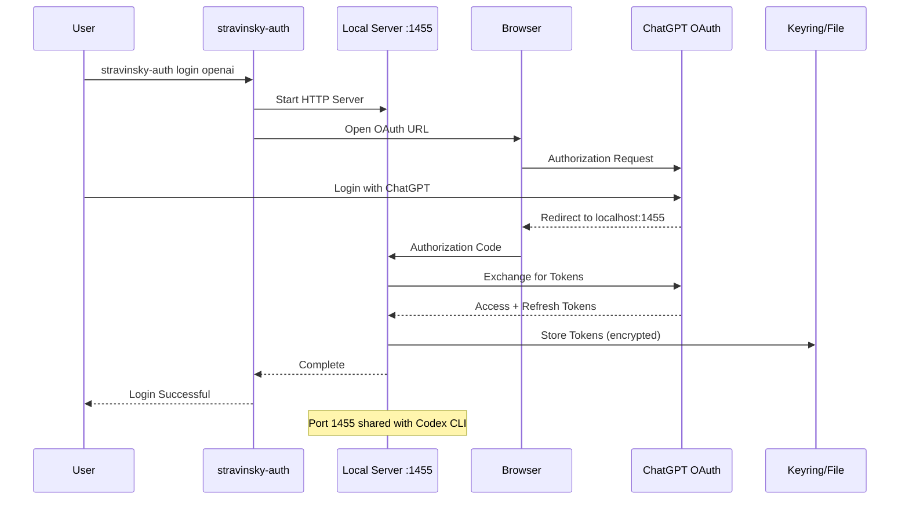
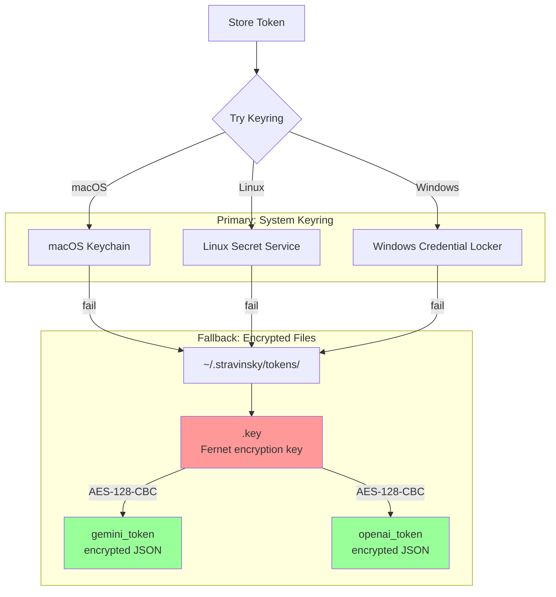
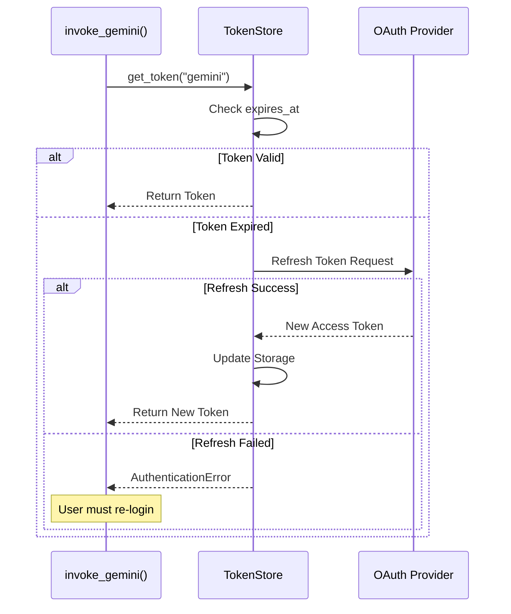
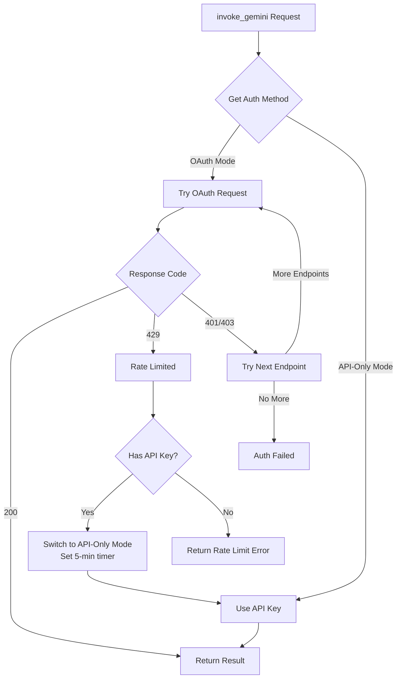
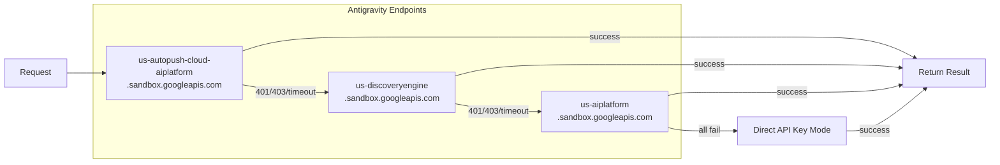
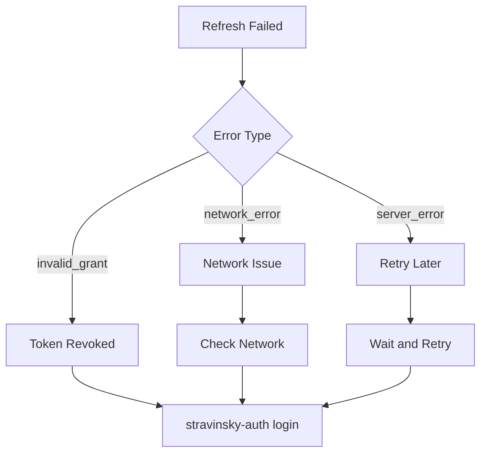

# OAuth Authentication Flow

This document details Stravinsky's OAuth authentication architecture for Gemini and OpenAI integration.

## Overview

Stravinsky uses an **OAuth-first with API fallback** strategy:
1. Try OAuth authentication first (better rate limits)
2. On 429 rate limit, fall back to API key for 5 minutes
3. Automatically retry OAuth after cooldown



## Authentication Methods

### Gemini OAuth (Google Antigravity)



### OpenAI OAuth (ChatGPT Backend)



## Token Storage Architecture

### Storage Priority



### Token Data Structure

```python
{
    "access_token": "ya29.xxx...",
    "refresh_token": "1//xxx...",
    "expires_at": 1704567890.123,  # Unix timestamp
    "token_type": "Bearer",
    "scope": ["openid", "email", "profile"]
}
```

### File Permissions

| File | Permissions | Purpose |
|------|-------------|---------|
| `~/.stravinsky/tokens/` | `0o700` | Token directory |
| `.key` | `0o600` | Encryption key |
| `*_token` | `0o600` | Encrypted tokens |

## Token Refresh Flow



## Rate Limit Handling

### 429 Detection and Fallback



### State Machine

```python
# Global state variables
_GEMINI_OAUTH_429_TIMESTAMP: float | None = None
_OAUTH_COOLDOWN_SECONDS = 300  # 5 minutes

def _is_api_only_mode() -> bool:
    if _GEMINI_OAUTH_429_TIMESTAMP is None:
        return False
    elapsed = time.time() - _GEMINI_OAUTH_429_TIMESTAMP
    if elapsed >= _OAUTH_COOLDOWN_SECONDS:
        # Auto-reset after cooldown
        _GEMINI_OAUTH_429_TIMESTAMP = None
        return False
    return True

def _set_api_only_mode(reason: str):
    global _GEMINI_OAUTH_429_TIMESTAMP
    _GEMINI_OAUTH_429_TIMESTAMP = time.time()
    print(f"⚠️ OAuth rate-limited. Using API key for 5 minutes")
```

## Endpoint Fallback (Gemini)

Antigravity uses multiple endpoints for redundancy:



## Auth Configuration Commands

### Login Commands

```bash
# Gemini OAuth
stravinsky-auth login gemini

# OpenAI OAuth (requires ChatGPT Plus/Pro)
stravinsky-auth login openai

# Check status
stravinsky-auth status

# Logout
stravinsky-auth logout gemini
stravinsky-auth logout openai
```

### API Key Fallback

```bash
# Add to .env file
GEMINI_API_KEY=your_api_key_here
# OR
GOOGLE_API_KEY=your_api_key_here
```

## Troubleshooting

### Password Prompts (macOS)

If experiencing persistent keychain prompts:

```bash
# Configure keyring to use encrypted files instead
mkdir -p ~/.config/python_keyring
cat > ~/.config/python_keyring/keyringrc.cfg << EOF
[backend]
default-keyring = keyring.backends.fail.Keyring
EOF

# Re-authenticate
stravinsky-auth login gemini
```

### Port 1455 Conflict

```bash
# OpenAI shares port with Codex CLI
# Stop Codex if running:
killall codex

# Then retry login
stravinsky-auth login openai
```

### Token Refresh Failures



## Security Considerations

### Token Protection

1. **Encrypted at rest**: Tokens stored with Fernet (AES-128-CBC)
2. **Restricted permissions**: Files readable only by owner (0o600)
3. **No environment exposure**: Tokens never in env vars or logs
4. **Automatic refresh**: Minimizes exposure of long-lived tokens

### Best Practices

- Use OAuth over API keys when possible
- Keep `.stravinsky/` directory permissions restricted
- Re-authenticate periodically to refresh credentials
- Use `stravinsky-auth logout` when done with a machine

## Related Documentation

- [Architecture Overview](ARCHITECTURE.md)
- [MCP Tool Flow](MCP_TOOL_FLOW.md)
- [Keyring Auth Fix](KEYRING_AUTH_FIX.md)
