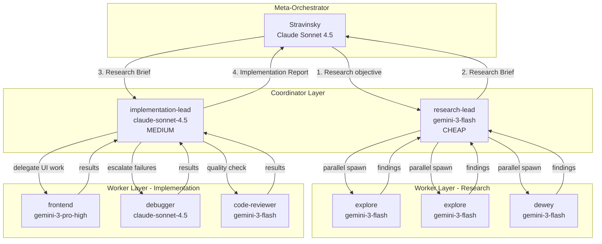
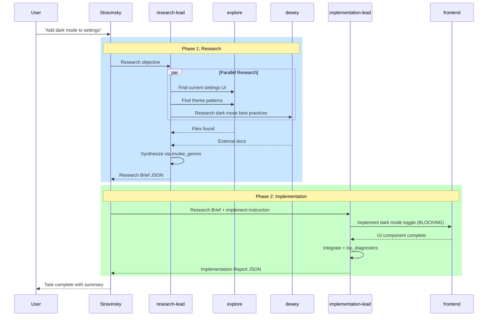

# Agent Orchestration Architecture

This document details Stravinsky's agent spawning and orchestration patterns for parallel execution.

## Overview

Stravinsky implements an **Enforced Parallelism** pattern with hard parallel execution validation. It uses native Claude Code subagents with automatic delegation to external models via MCP tools, enforced by the `DelegationEnforcer` and `TaskGraph` system.


## Agent Types and Model Routing

### Complete Agent Configuration

| Agent | Display Model | Cost Tier | CLI Model | Use Case |
|-------|---------------|-----------|-----------|----------|
| **explore** | gemini-3-flash | CHEAP | None (default) | Codebase search, file discovery |
| **dewey** | gemini-3-flash | CHEAP | None | Documentation research |
| **document_writer** | gemini-3-flash | CHEAP | None | Technical documentation |
| **multimodal** | gemini-3-flash | CHEAP | None | Visual analysis |
| **research-lead** | gemini-3-flash | CHEAP | None | Research coordination |
| **momus** | gemini-3-flash | CHEAP | None | Quality gate validation |
| **comment_checker** | gemini-3-flash | CHEAP | None | Documentation completeness |
| **code-reviewer** | gemini-3-flash | CHEAP | None | Code quality analysis |
| **frontend** | gemini-3-pro-high | MEDIUM | None | UI/UX implementation |
| **debugger** | claude-sonnet-4.5 | MEDIUM | sonnet | Root cause analysis |
| **implementation-lead** | claude-sonnet-4.5 | MEDIUM | sonnet | Execution coordination |
| **delphi** | gpt-5.2 | EXPENSIVE | None | Strategic architecture |
| **planner** | opus-4.5 | EXPENSIVE | opus | Pre-implementation planning |

### Cost Tier Distribution


**Principle**: Use the cheapest agent that can complete the task.

## Agent Delegation Prompts

Stravinsky uses `AGENT_DELEGATION_PROMPTS` - a dictionary of full delegation prompts injected into agents at spawn time. This is critical for cross-repo MCP installations where agents lack access to `.claude/agents/*.md` files.

### Delegation Prompt Structure

Each agent receives a delegation prompt that:

1. Identifies the agent as a **thin wrapper**
2. Instructs immediate delegation to the appropriate model
3. Specifies the exact MCP tool to call (`invoke_gemini_agentic` vs `invoke_gemini`)
4. Provides example delegation code

### Example: Explore Agent Delegation Prompt

```markdown
## CRITICAL: YOU ARE A THIN WRAPPER - DELEGATE TO GEMINI IMMEDIATELY

You are the Explore agent. Your ONLY job is to delegate ALL work to Gemini Flash with full tool access.

**IMMEDIATELY** call `mcp__stravinsky__invoke_gemini_agentic` with:
- **model**: `gemini-3-flash`
- **prompt**: The complete task description below, plus instructions to use search tools
- **max_turns**: 10 (allow multi-step search workflows)

**CRITICAL**: Use `invoke_gemini_agentic` NOT `invoke_gemini`. The agentic version enables Gemini to call tools like `semantic_search`, `grep_search`, `ast_grep_search` - the plain version cannot.

**DO NOT** answer directly. **DO NOT** use search tools yourself.
Delegate to Gemini FIRST, then return Gemini's response.
```

### Delegation Target Models

| Agent | Delegation Target | MCP Tool | Max Turns |
|-------|-------------------|----------|-----------|
| explore | gemini-3-flash | invoke_gemini_agentic | 10 |
| dewey | gemini-3-flash | invoke_gemini_agentic | 10 |
| frontend | gemini-3-pro | invoke_gemini_agentic | 10 |
| delphi | gpt-5.2-codex | invoke_openai | N/A |
| code-reviewer | gemini-3-flash | invoke_gemini_agentic | 10 |
| momus | gemini-3-flash | invoke_gemini_agentic | 10 |
| multimodal | gemini-3-flash | invoke_gemini | N/A |
| comment_checker | gemini-3-flash | invoke_gemini_agentic | 10 |
| document_writer | gemini-3-flash | invoke_gemini_agentic | 10 |
| debugger | N/A (native) | Uses LSP tools directly | N/A |

## TaskGraph and Parallel Execution

### TaskGraph Overview

The `TaskGraph` class (`mcp_bridge/orchestrator/task_graph.py`) provides:

- **Directed Acyclic Graph** of tasks with dependency tracking
- **Wave-based execution** - tasks with no dependencies are grouped into "waves"
- **Status tracking** - PENDING, SPAWNED, RUNNING, COMPLETED, FAILED

```python
from mcp_bridge.orchestrator.task_graph import TaskGraph

# Create a task graph
graph = TaskGraph.from_dict({
    "task_a": {"description": "Search code", "agent_type": "explore", "depends_on": []},
    "task_b": {"description": "Research docs", "agent_type": "dewey", "depends_on": []},
    "task_c": {"description": "Implement", "agent_type": "frontend", "depends_on": ["task_a", "task_b"]}
})

# Get execution waves
waves = graph.get_independent_groups()
# Wave 1: [task_a, task_b]  <- Must spawn in parallel
# Wave 2: [task_c]          <- Depends on wave 1
```

### DelegationEnforcer

The `DelegationEnforcer` class provides **hard enforcement** of parallel execution rules:

```python
from mcp_bridge.orchestrator.task_graph import DelegationEnforcer, TaskGraph

# Create enforcer with 500ms parallel window
enforcer = DelegationEnforcer(
    task_graph=graph,
    parallel_window_ms=500,  # Max time between parallel spawns
    strict=True              # Raise errors on violations
)

# Validate a spawn
is_valid, error = enforcer.validate_spawn("task_a")
if not is_valid:
    raise ParallelExecutionError(error)

# Record the spawn
enforcer.record_spawn("task_a", "agent_abc123")
```

### Parallel Enforcement Rules

1. **Wave Validation**: Tasks can only spawn if their dependencies are complete
2. **Timing Validation**: All tasks in a wave must spawn within `parallel_window_ms` (default 500ms)
3. **Sequential Blocking**: Spawning wave 2 tasks before wave 1 completes raises `ParallelExecutionError`

### task_graph_id Parameter

The `agent_spawn` function accepts an optional `task_graph_id` parameter for parallel enforcement:

```python
await agent_spawn(
    prompt="Search for auth implementations",
    agent_type="explore",
    task_graph_id="task_a",  # Links to TaskGraph for validation
)
```

When `task_graph_id` is provided and a `DelegationEnforcer` is active:

1. The enforcer validates the spawn is allowed
2. The spawn timing is recorded
3. Violations raise `ParallelExecutionError`

## Parallel Execution Pattern

### Correct Pattern: Wave-Based Parallel Spawning


### Anti-Pattern: Sequential Execution


## Agent Spawn Flow

### spawn_agent() Implementation


### Agent Execution Environment

```python
# Agent subprocess command (built by AgentManager)
cmd = [
    "/opt/homebrew/bin/claude",
    "-p", full_prompt,  # Includes delegation prompt
    "--output-format", "text",
    "--dangerously-skip-permissions",
]

# Model routing (from AGENT_MODEL_ROUTING)
if cli_model:  # e.g., "sonnet" for debugger
    cmd.extend(["--model", cli_model])

# Thinking budget (for complex reasoning)
if thinking_budget > 0:
    cmd.extend(["--thinking-budget", str(thinking_budget)])
```

## Thin Wrapper Pattern

### Why Thin Wrappers?

Claude Code's `Task` system only supports Claude models. To access Gemini/GPT efficiently:


**Key Difference**: `invoke_gemini_agentic` enables Gemini to use tools like `semantic_search`, `grep_search`, and `ast_grep_search`. The non-agentic version cannot call tools.

### Wrapper Implementation in AGENT_DELEGATION_PROMPTS

Each delegation prompt instructs the agent to:

1. **Parse** the incoming task
2. **Immediately call** `invoke_gemini_agentic` or `invoke_openai`
3. **Pass through** the full context with tool usage instructions
4. **Return** the external model's response unchanged

## Delegation Rules

### When to Use Each Agent


### Agent Tool Access

Each agent type has a defined set of allowed tools (from `AGENT_TOOLS`):

| Agent | Allowed Tools |
|-------|---------------|
| stravinsky | all |
| explore | Read, Grep, Glob, Bash, semantic_search, ast_grep_search, lsp_workspace_symbols |
| dewey | Read, Grep, Glob, Bash, WebSearch, WebFetch |
| frontend | Read, Edit, Write, Grep, Glob, Bash, invoke_gemini |
| delphi | Read, Grep, Glob, Bash, invoke_openai |
| debugger | Read, Grep, Glob, Bash, lsp_diagnostics, lsp_hover, ast_grep_search |
| code-reviewer | Read, Grep, Glob, Bash, lsp_diagnostics, ast_grep_search |
| momus | Read, Grep, Glob, Bash, lsp_diagnostics, ast_grep_search |
| comment_checker | Read, Grep, Glob, Bash, ast_grep_search, lsp_document_symbols |
| document_writer | Read, Write, Grep, Glob, Bash, invoke_gemini |
| multimodal | Read, invoke_gemini |
| planner | Read, Grep, Glob, Bash |

## Agent Hierarchy Enforcement

### Orchestrator vs Worker Agents

```python
ORCHESTRATOR_AGENTS = ["stravinsky", "research-lead", "implementation-lead"]
WORKER_AGENTS = [
    "explore", "dewey", "delphi", "frontend", "debugger",
    "code-reviewer", "momus", "comment_checker",
    "document_writer", "multimodal", "planner"
]
```

### Hierarchy Rules

1. **Orchestrators can spawn any agent**
2. **Workers cannot spawn orchestrators**
3. **Workers cannot spawn other workers**

This prevents infinite delegation loops and maintains clear responsibility chains.

## Coordinator Agents (research-lead and implementation-lead)

Stravinsky uses a **two-phase coordinator pattern** that separates research from implementation. Both coordinators are ORCHESTRATOR_AGENTS with full agent spawning capabilities and proper AGENT_DELEGATION_PROMPTS for cross-repo MCP compatibility.

### Coordinator Hierarchy



### research-lead Coordinator

**Role**: Spawns explore and dewey agents in parallel, synthesizes findings into a structured Research Brief.

**Configuration**:
| Property | Value |
|----------|-------|
| Model | gemini-3-flash |
| Cost Tier | CHEAP |
| CLI Model | None (default) |
| Tools | agent_spawn, agent_output, invoke_gemini, Read, Grep, Glob |

**Delegation Prompt** (from `AGENT_DELEGATION_PROMPTS`):

The research-lead receives a delegation prompt that instructs it to:
1. Act as a research coordinator (not a direct researcher)
2. Spawn explore agents for codebase search
3. Spawn dewey agents for documentation research
4. Use `invoke_gemini_agentic` for synthesis work
5. Return a structured Research Brief JSON

**Output Format** (Research Brief):

```json
{
  "objective": "Original research goal stated clearly",
  "findings": [
    {
      "source": "agent_id or tool_name",
      "summary": "Key finding in 1-2 sentences",
      "confidence": "high|medium|low",
      "evidence": "Specific file paths, function names, or data points"
    }
  ],
  "synthesis": "Combined analysis of all findings (2-3 paragraphs)",
  "gaps": ["Information we couldn't find", "Areas needing more investigation"],
  "recommendations": ["Suggested next steps for implementation"]
}
```

**Delegation Patterns**:

| Pattern | Description | Agents Spawned |
|---------|-------------|----------------|
| Code Search (Parallel) | Find feature implementation | 2-3 explore agents in parallel |
| Architecture Research (Sequential) | Deep dive after initial findings | explore -> explore -> dewey |
| Semantic/Conceptual Search | Find code by meaning, not text | explore with semantic_search guidance |

### implementation-lead Coordinator

**Role**: Receives Research Brief from Stravinsky, creates implementation plan, delegates to specialists, verifies with LSP diagnostics.

**Configuration**:
| Property | Value |
|----------|-------|
| Model | claude-sonnet-4.5 |
| Cost Tier | MEDIUM |
| CLI Model | sonnet |
| Tools | agent_spawn, agent_output, lsp_diagnostics, Read, Write, Edit, Grep, Glob |

**Delegation Prompt** (from `AGENT_DELEGATION_PROMPTS`):

The implementation-lead receives a delegation prompt that instructs it to:
1. Receive Research Brief and create implementation plan
2. Delegate ALL UI/visual work to frontend agent (BLOCKING)
3. Spawn debugger after 2+ failed attempts
4. Spawn code-reviewer for quality checks
5. ALWAYS run lsp_diagnostics before completion
6. Return a structured Implementation Report JSON

**Output Format** (Implementation Report):

```json
{
  "objective": "What was implemented (1 sentence)",
  "files_changed": ["path/to/file.py", "path/to/other.ts"],
  "tests_status": "pass|fail|skipped",
  "diagnostics": {
    "status": "clean|warnings|errors",
    "details": ["List of remaining issues if any"]
  },
  "blockers": ["Issues preventing completion"],
  "next_steps": ["What remains to be done"]
}
```

**Delegation Patterns**:

| Pattern | Description | Agents Spawned |
|---------|-------------|----------------|
| Pure Backend | No UI work needed | None (direct implementation) |
| Frontend Required | UI components needed | frontend (BLOCKING) -> code-reviewer |
| Debugging After Failures | 2+ failed attempts | debugger -> apply suggestions |

**Escalation Rules**:

| Scenario | Action |
|----------|--------|
| 2+ failed attempts | Spawn debugger |
| Debugger fails | Escalate to Stravinsky with full context |
| Frontend needed | Spawn frontend (BLOCKING) |
| Quality check | Spawn code-reviewer (async) |
| Architecture decision | Escalate to Stravinsky (never call Delphi directly) |

### Coordinator Communication Flow



### Cross-Repo MCP Compatibility

Both coordinator agents have full `AGENT_DELEGATION_PROMPTS` defined in `mcp_bridge/tools/agent_manager.py`. This is critical for cross-repo installations where the `.claude/agents/*.md` files may not be accessible.

**Why this matters**:
- When Stravinsky is installed via `uvx stravinsky@latest`, the agent markdown files are not deployed
- The delegation prompts embedded in Python ensure coordinators work correctly regardless of installation method
- Both coordinators receive their full behavioral instructions via the delegation prompt injection

**Delegation Prompt Injection**:

```python
# From agent_manager.py - coordinators receive full prompts
AGENT_DELEGATION_PROMPTS = {
    "research-lead": """## YOU ARE A RESEARCH COORDINATOR - SPAWN AGENTS AND SYNTHESIZE
    ...
    - Pass Research Brief to implementation-lead (via Stravinsky) when complete""",

    "implementation-lead": """## YOU ARE AN IMPLEMENTATION COORDINATOR - RECEIVE BRIEF AND EXECUTE
    ...
    - Return Implementation Report JSON when complete"""
}
```

### Cost Optimization

The coordinator pattern optimizes costs by:

1. **research-lead uses CHEAP tier** (gemini-3-flash) - research coordination is low-cost
2. **implementation-lead uses MEDIUM tier** (claude-sonnet-4.5) - code editing requires higher capability
3. **Workers remain cost-appropriate** - explore/dewey are CHEAP, frontend is MEDIUM
4. **Delphi (EXPENSIVE) is never spawned by coordinators** - only Stravinsky escalates to Delphi

| Agent | Cost Tier | Typical Task Cost |
|-------|-----------|-------------------|
| research-lead | CHEAP | ~$0.01-0.05 |
| implementation-lead | MEDIUM | ~$0.10-0.50 |
| explore (per spawn) | CHEAP | ~$0.005 |
| frontend (per spawn) | MEDIUM | ~$0.05-0.20 |

## DelegationEnforcer API Reference

### Setting the Enforcer

```python
from mcp_bridge.tools.agent_manager import set_delegation_enforcer, clear_delegation_enforcer

# Activate during DELEGATE phase
set_delegation_enforcer(enforcer)

# Clear after execution complete
clear_delegation_enforcer()
```

### Enforcement Status

```python
status = enforcer.get_enforcement_status()
# Returns:
# {
#     "current_wave": 1,
#     "total_waves": 3,
#     "current_wave_tasks": ["task_a", "task_b"],
#     "spawn_batch": [("task_a", 1642000000.5), ...],
#     "task_statuses": {"task_a": "spawned", "task_b": "pending", ...}
# }
```

### Wave Advancement

```python
# Manually advance to next wave (usually automatic)
has_more = enforcer.advance_wave()

# Mark task completed (triggers wave check)
enforcer.mark_task_completed("task_a")
```

## Error Handling

### ParallelExecutionError

Raised when parallel execution rules are violated:

```python
from mcp_bridge.orchestrator.task_graph import ParallelExecutionError

try:
    await agent_spawn(..., task_graph_id="task_c")
except ParallelExecutionError as e:
    # "Spawn blocked: Task 'task_c' has unmet dependencies.
    #  Current wave tasks: ['task_a', 'task_b']"
    print(f"Parallel violation: {e}")
```

### Common Violations

| Violation | Error Message | Solution |
|-----------|---------------|----------|
| Out-of-order spawn | "Task X has unmet dependencies" | Wait for wave 1 to complete |
| Slow parallel spawn | "Time spread Xms > 500ms limit" | Spawn all wave tasks in same response |
| Unknown task | "Unknown task: X" | Ensure task_graph_id matches TaskGraph |

## ULTRATHINK / ULTRAWORK Modes

### ULTRATHINK

Extended thinking budget for complex reasoning:

```python
await agent_spawn(
    prompt="Complex architecture analysis",
    agent_type="planner",
    thinking_budget=32000,  # 32k thinking tokens
)
```

### ULTRAWORK

Maximum parallel execution - spawn all independent agents immediately:


**Rule**: Launch ALL independent agents in ONE response within 500ms window.

## Best Practices

### Do's

- Fire all independent agents in ONE response (within parallel window)
- Use cheapest agent tier that can complete the task
- Use `task_graph_id` for TaskGraph-based orchestration
- Monitor with `agent_progress` for long-running tasks
- Clear the DelegationEnforcer after orchestration completes

### Don'ts

- Don't use `delphi` for simple searches (use `explore`)
- Don't spawn wave 2 tasks before wave 1 completes
- Don't exceed the parallel_window_ms between wave task spawns
- Don't spawn orchestrator agents from worker agents

## Related Documentation

- [Architecture Overview](ARCHITECTURE.md)
- [Agent Workflow](AGENT_WORKFLOW.md)
- [Agents Guide](../guides/AGENTS.md)
- [MCP Tool Flow](MCP_TOOL_FLOW.md)
