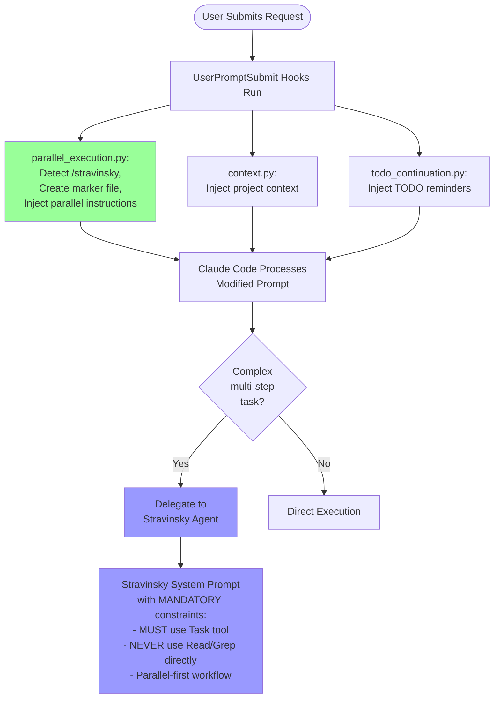
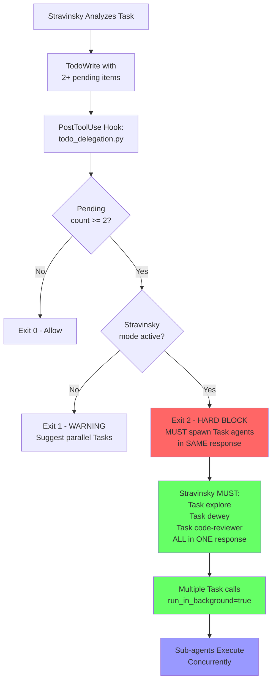
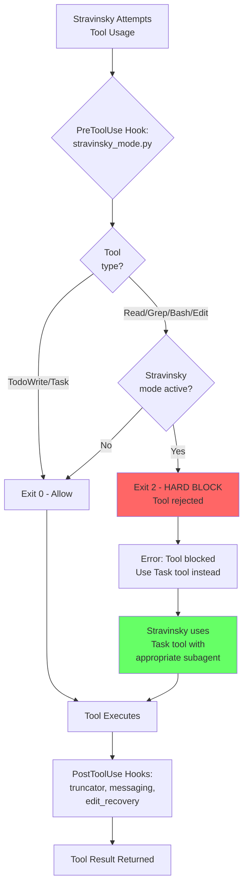
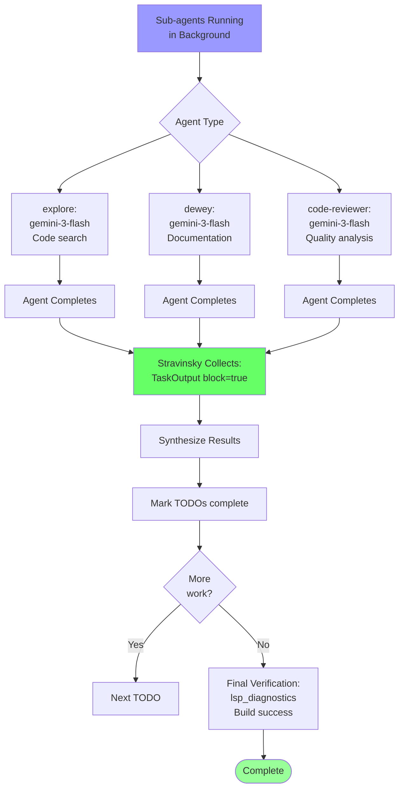
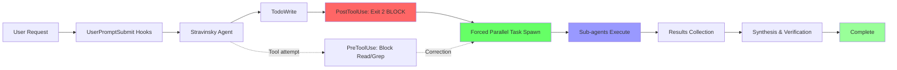

# Stravinsky Agent Workflow - Complete Process Flow

## Executive Summary

Stravinsky uses a **three-layer enforcement system** combining Claude Code's native hooks, native sub-agents, and specialized agent prompts to enforce parallel task delegation. This document provides the definitive flowchart showing EXACTLY how the process works from user request to agent execution.

---

## Quick Reference: Hook and Agent Types

### Hook Types (15 hooks)
| Hook File | Type | Trigger | Exit Codes | Purpose |
|-----------|------|---------|-----------|----------|
| `parallel_execution.py` | UserPromptSubmit | Before response | 0 | Inject parallel instructions, activate stravinsky mode |
| `context.py` | UserPromptSubmit | Before response | 0 | Inject project context |
| `todo_continuation.py` | UserPromptSubmit | Before response | 0 | Inject incomplete TODO reminders |
| `notification_hook.py` | Notification | On notifications | 0 | Agent spawn messages (Legacy) |
| `notification_hook_v2.py` | Notification | On notifications | 0 | Enhanced agent spawn messages with colors |
| `stravinsky_mode.py` | PreToolUse | Before tool execution | 0=Allow, 2=Block | Block direct tool usage in stravinsky mode |
| `pre_compact.py` | PreCompact | Before compaction | 0 | Context preservation |
| `todo_delegation.py` | PostToolUse | After TodoWrite | 0=OK, 1=Warn, 2=Block | Enforce parallel Task spawning |
| `tool_messaging.py` | PostToolUse | After tool execution | 0 | User-friendly tool/agent messages |
| `edit_recovery.py` | PostToolUse | After Edit/MultiEdit | 0 | Edit failure recovery guidance |
| `truncator.py` | PostToolUse | After tool execution | 0 | Truncate large outputs (>30k chars) |
| `subagent_stop.py` | SubagentStop | On agent completion | 0=OK, 2=Block | Agent completion handling |
| `dependency_tracker.py` | UserPromptSubmit | Before response | 0 | Track task dependencies for smart parallelization |
| `execution_state_tracker.py` | UserPromptSubmit | Before response | 0 | Track execution state to detect sequential fallback |
| `parallel_reinforcement_v2.py`| UserPromptSubmit | Before response | 0 | Smart reinforcement of parallel delegation |
| `ralph_loop.py` | PostAssistantMessage | After response | 0 | Auto-continue incomplete work |


### Agent Types (7 agents)
| Agent | Model | Cost | Execution | Use For |
|-------|-------|------|-----------|---------|
| **stravinsky** | Claude Sonnet 4.5 | Moderate | Primary orchestrator | Multi-step tasks, delegation coordination |
| **explore** | Gemini 3 Flash | Free | Async | Code search, file reading, pattern finding |
| **dewey** | Gemini 3 Flash | Cheap | Async | Documentation research, OSS examples |
| **code-reviewer** | Gemini 3 Flash | Cheap | Async | Quality analysis, security scanning |
| **debugger** | Claude Sonnet | Medium | Blocking (2+ failures) | Root cause analysis |
| **frontend** | Gemini 3 Pro High | Medium | Blocking (ALL visual) | UI/UX implementation |
| **delphi** | Claude Sonnet + GPT-5.2 | Expensive | Blocking (3+ failures) | Strategic architecture, hard debugging |

---

## Complete Workflow Diagrams

### Phase 1: Hook Processing and Agent Activation



### Phase 2: TodoWrite and Parallel Delegation Enforcement



### Phase 3: PreToolUse Hook Enforcement



### Phase 4: Agent Execution and Results Synthesis



### Combined: Complete Flow Summary



---

## Detailed Step-by-Step Flow

### Phase 1: User Request → Hook Processing

```
┌─────────────────────────────────────────────────────────────────┐
│ 1. USER SUBMITS REQUEST                                          │
│    Examples:                                                      │
│    - "/stravinsky implement authentication"                      │
│    - "Add dark mode to the app"                                  │
│    - "ultrawork - refactor the codebase"                          │
└─────────────────────────────────────────────────────────────────┘
                              ↓
┌─────────────────────────────────────────────────────────────────┐
│ 2. UserPromptSubmit HOOKS (Run in Parallel)                      │
├─────────────────────────────────────────────────────────────────┤
│ Hook 1: parallel_execution.py                                    │
│   - Detects: /stravinsky, ultrawork, ultrathink, implementation  │
│   - Action 1: CREATE ~/.stravinsky_mode marker file             │
│   - Action 2: INJECT parallel execution instructions to prompt   │
│   - Output: Modified prompt with [🔄 PARALLEL EXECUTION MODE]   │
│                                                                   │
│ Hook 2: context.py                                               │
│   - Searches: AGENTS.md, README.md, CLAUDE.md                   │
│   - Action: PREPEND project context to prompt                    │
│   - Output: "--- LOCAL CONTEXT: README.md ---\n[content]"       │
│                                                                   │
│ Hook 3: todo_continuation.py                                     │
│   - Reads: .claude/todo_state.json                              │
│   - Detects: in_progress or pending TODOs                        │
│   - Action: INJECT reminder about incomplete work                │
│   - Output: "[SYSTEM REMINDER - TODO CONTINUATION]"             │
└─────────────────────────────────────────────────────────────────┘
                              ↓
                    ALL HOOKS EXIT CODE 0
                    (prompts modified, pass through)
```

### Phase 2: Claude Code Auto-Delegation

```
┌─────────────────────────────────────────────────────────────────┐
│ 3. CLAUDE CODE PROCESSES MODIFIED PROMPT                         │
│    Prompt now contains:                                           │
│    - [🔄 PARALLEL EXECUTION MODE ACTIVE] instructions           │
│    - --- LOCAL CONTEXT: README.md --- (project documentation)   │
│    - [SYSTEM REMINDER - TODO CONTINUATION] (if applicable)      │
│    - Original user request                                       │
└─────────────────────────────────────────────────────────────────┘
                              ↓
┌─────────────────────────────────────────────────────────────────┐
│ 4. AUTO-DELEGATION DECISION                                      │
│    Claude Code evaluates:                                         │
│    - Is task complex (3+ steps)?        → YES                    │
│    - Does description match "stravinsky"? → YES                  │
│    - Is this multi-step implementation?  → YES                   │
│                                                                   │
│    Decision: DELEGATE to stravinsky sub-agent                    │
│    Method: Task(subagent_type="stravinsky", ...)                │
└─────────────────────────────────────────────────────────────────┘
                              ↓
┌─────────────────────────────────────────────────────────────────┐
│ 5. STRAVINSKY AGENT ACTIVATED                                    │
│    System Prompt Sections Loaded:                                │
│    - Phase 0: Skill gate (check skill_list first)               │
│    - Phase 1: Intent classification                              │
│    - Phase 2: Aggressive delegation                              │
│    - Phase 2B: Parallel task execution (CRITICAL section)        │
│    - Phase 3: Relentless completion                              │
│    - MANDATORY tool usage (MUST use Task, NOT Read/Grep)        │
│    - 7-section delegation template                               │
│    - ULTRAWORK mode                                               │
│                                                                   │
│    Key Constraints from Prompt:                                  │
│    ❌ NEVER use Read/Grep/Bash directly                         │
│    ✅ ALWAYS delegate to Task(subagent_type="explore", ...)    │
│    ✅ TodoWrite → IMMEDIATE Task spawning (SAME response)       │
└─────────────────────────────────────────────────────────────────┘
```

### Phase 3: Stravinsky Creates TODOs

```
┌─────────────────────────────────────────────────────────────────┐
│ 6. STRAVINSKY ANALYZES TASK                                      │
│    Task: "Implement authentication system"                       │
│                                                                   │
│    Breakdown into TODOs:                                         │
│    1. Research JWT best practices (dewey)                        │
│    2. Find existing auth implementations (explore)               │
│    3. Design auth flow (code-reviewer)                           │
│    4. Implement login endpoint (independent)                     │
│    5. Implement token refresh (independent)                      │
│    6. Write tests (independent)                                  │
└─────────────────────────────────────────────────────────────────┘
                              ↓
┌─────────────────────────────────────────────────────────────────┐
│ 7. STRAVINSKY CALLS: TodoWrite([6 items])                       │
│    Creates todo_state.json with 6 pending items                  │
└─────────────────────────────────────────────────────────────────┘
                              ↓
┌─────────────────────────────────────────────────────────────────┐
│ 8. PostToolUse HOOK: todo_delegation.py FIRES                   │
│    Input: tool_name = "TodoWrite"                                │
│    Reads: tool result, counts pending items                      │
│    Finds: 6 pending items                                        │
│                                                                   │
│    Logic:                                                         │
│    pending_count = 6                                              │
│    if pending_count >= 2:                                         │
│        if os.path.exists("~/.stravinsky_mode"):  # TRUE         │
│            return EXIT CODE 2  # HARD BLOCK                      │
│                                                                   │
│    Output to stderr:                                             │
│    🚨 PARALLEL DELEGATION REQUIRED 🚨                           │
│    TodoWrite created 6 pending items.                            │
│    ⚠️ STRAVINSKY MODE ACTIVE                                    │
│    You MUST spawn Task agents for ALL independent TODOs          │
│    in THIS SAME RESPONSE.                                        │
│                                                                   │
│    DO NOT:                                                        │
│    - End your response without spawning Tasks                    │
│    - Mark TODOs in_progress before spawning Tasks                │
│                                                                   │
│    EXIT CODE 2 = HARD BLOCK                                      │
└─────────────────────────────────────────────────────────────────┘
                              ↓
            CLAUDE CODE SEES: Exit code 2 = blocking error
            MESSAGE: Must spawn Task agents immediately
```

### Phase 4: Forced Parallel Delegation

```
┌─────────────────────────────────────────────────────────────────┐
│ 9. STRAVINSKY FORCED CORRECTION                                  │
│    System Prompt + Hook Message = MANDATORY pattern              │
│                                                                   │
│    Stravinsky MUST now execute (in SAME response):               │
│                                                                   │
│    Task(                                                          │
│      subagent_type="dewey",                                      │
│      prompt="## TASK\nResearch JWT best practices...",          │
│      description="Research JWT",                                 │
│      run_in_background=true                                      │
│    )                                                              │
│    → dewey:gemini-3-flash('Research JWT') task_id=agent_abc123  │
│                                                                   │
│    Task(                                                          │
│      subagent_type="explore",                                    │
│      prompt="## TASK\nFind existing auth implementations...",   │
│      description="Find auth code",                               │
│      run_in_background=true                                      │
│    )                                                              │
│    → explore:gemini-3-flash('Find auth') task_id=agent_def456   │
│                                                                   │
│    Task(                                                          │
│      subagent_type="code-reviewer",                              │
│      prompt="## TASK\nReview auth flow design...",              │
│      description="Review auth design",                           │
│      run_in_background=true                                      │
│    )                                                              │
│    → code-reviewer:sonnet('Review design') task_id=agent_ghi789 │
│                                                                   │
│    ALL 3 TASKS FIRED IN PARALLEL IN ONE RESPONSE                 │
└─────────────────────────────────────────────────────────────────┘
                              ↓
┌─────────────────────────────────────────────────────────────────┐
│ 10. PostToolUse HOOK: tool_messaging.py                         │
│     Triggered for each Task call                                 │
│                                                                   │
│     Outputs to stderr (user sees):                               │
│     🎯 dewey:gemini-3-flash('Research JWT best practices')      │
│     🎯 explore:gemini-3-flash('Find existing auth')             │
│     🎯 code-reviewer:sonnet('Review auth flow design')          │
└─────────────────────────────────────────────────────────────────┘
```

### Phase 5: Sub-Agents Execute in Parallel

```
┌─────────────────────────────────────────────────────────────────┐
│ 11. SUB-AGENTS EXECUTE CONCURRENTLY                              │
│                                                                   │
│ Agent: dewey (task_id=agent_abc123)                             │
│ ├─ Model: Claude Sonnet                                         │
│ ├─ Tools: Read, WebSearch, WebFetch, invoke_gemini, grep.app   │
│ ├─ Task: Research JWT best practices from official sources      │
│ ├─ Status: RUNNING (background)                                 │
│ └─ Result: Will return research summary + sources               │
│                                                                   │
│ Agent: explore (task_id=agent_def456)                           │
│ ├─ Model: Claude Sonnet                                         │
│ ├─ Tools: Read, Grep, Glob, Bash, ast_grep, LSP tools          │
│ ├─ Task: Find existing auth code in codebase                    │
│ ├─ Status: RUNNING (background)                                 │
│ └─ Result: Will return file paths + line numbers + code         │
│                                                                   │
│ Agent: code-reviewer (task_id=agent_ghi789)                     │
│ ├─ Model: Claude Sonnet                                         │
│ ├─ Tools: Read, Grep, lsp_diagnostics, ast_grep                │
│ ├─ Task: Review proposed auth flow design                       │
│ ├─ Status: RUNNING (background)                                 │
│ └─ Result: Will return security analysis + recommendations      │
└─────────────────────────────────────────────────────────────────┘
                              ↓
              ALL AGENTS RUN INDEPENDENTLY
              NO BLOCKING OF MAIN ORCHESTRATOR
```

### Phase 6: Stravinsky Attempts Direct Tool Usage (Hypothetical)

```
┌─────────────────────────────────────────────────────────────────┐
│ 12. HYPOTHETICAL: Stravinsky tries Read tool                    │
│     (This violates MANDATORY constraints)                        │
│                                                                   │
│     Stravinsky calls: Read(file_path="src/auth/login.py")       │
└─────────────────────────────────────────────────────────────────┘
                              ↓
┌─────────────────────────────────────────────────────────────────┐
│ 13. PreToolUse HOOK: stravinsky_mode.py INTERCEPTS              │
│     Input: tool_name = "Read"                                    │
│     Check: os.path.exists("~/.stravinsky_mode") → TRUE          │
│                                                                   │
│     Logic:                                                        │
│     blocked_tools = ["Read", "Grep", "Bash", "Edit", ...]       │
│     if tool_name in blocked_tools:                               │
│         if stravinsky_mode_active:                               │
│             return EXIT CODE 2  # HARD BLOCK                     │
│                                                                   │
│     Outputs to stderr:                                           │
│     ⚠️ STRAVINSKY MODE ACTIVE - Read BLOCKED                    │
│                                                                   │
│     You are in Stravinsky orchestrator mode.                     │
│     Instead of using Read, you MUST use Task tool:               │
│       Task(subagent_type="explore", ...)                        │
│                                                                   │
│     EXIT CODE 2 = HARD BLOCK                                     │
└─────────────────────────────────────────────────────────────────┘
                              ↓
            READ TOOL REJECTED - NEVER EXECUTES
            Claude sees: "Tool blocked, use Task instead"
                              ↓
┌─────────────────────────────────────────────────────────────────┐
│ 14. STRAVINSKY CORRECTS                                          │
│     Sees error message, system prompt constraints                │
│     Uses Task tool instead:                                      │
│                                                                   │
│     Task(                                                         │
│       subagent_type="explore",                                   │
│       prompt="Read src/auth/login.py and analyze...",           │
│       description="Read login.py"                                │
│     )                                                             │
└─────────────────────────────────────────────────────────────────┘
```

### Phase 7: Results Collection and Synthesis

```
┌─────────────────────────────────────────────────────────────────┐
│ 15. STRAVINSKY COLLECTS RESULTS                                  │
│     When agents complete, stravinsky uses:                        │
│                                                                   │
│     TaskOutput(task_id="agent_abc123", block=true)              │
│     → dewey result: JWT best practices summary                   │
│                                                                   │
│     TaskOutput(task_id="agent_def456", block=true)              │
│     → explore result: Found auth code in:                        │
│         - src/auth/login.py:45                                   │
│         - src/auth/token.py:12                                   │
│                                                                   │
│     TaskOutput(task_id="agent_ghi789", block=true)              │
│     → code-reviewer result: Security analysis complete           │
└─────────────────────────────────────────────────────────────────┘
                              ↓
┌─────────────────────────────────────────────────────────────────┐
│ 16. STRAVINSKY SYNTHESIZES                                       │
│     Combines all agent results:                                   │
│     - JWT best practices → Use HTTP-only cookies                 │
│     - Existing auth → Extend current JWT implementation          │
│     - Security review → Add rate limiting, CSRF protection       │
│                                                                   │
│     Creates implementation plan                                  │
│     Updates TODOs:                                               │
│     - Mark TODOs 1, 2, 3 as COMPLETED                           │
│     - Mark TODOs 4, 5, 6 as IN_PROGRESS                         │
└─────────────────────────────────────────────────────────────────┘
                              ↓
┌─────────────────────────────────────────────────────────────────┐
│ 17. FINAL VERIFICATION                                           │
│     Stravinsky executes (when ALL work done):                    │
│                                                                   │
│     - lsp_diagnostics on modified files                          │
│     - Bash: run tests                                            │
│     - Verify all TODOs marked complete                           │
│     - Build succeeds                                             │
│                                                                   │
│     Only then: Mark task as COMPLETE                             │
└─────────────────────────────────────────────────────────────────┘
```

---

## Hook Execution Timeline

```
TIME →
═══════════════════════════════════════════════════════════════════════

User Request Submitted
│
├─ [0ms] UserPromptSubmit Hooks (PARALLEL)
│  ├─ parallel_execution.py (create marker, inject instructions)
│  ├─ context.py (inject CLAUDE.md)
│  └─ todo_continuation.py (inject TODO reminders)
│     ALL EXIT CODE 0 (pass through)
│
├─ [100ms] Claude Code processes modified prompt
│
├─ [150ms] Auto-delegates to stravinsky sub-agent
│
├─ [200ms] Stravinsky analyzes, creates TodoWrite
│
├─ [250ms] PostToolUse Hook: todo_delegation.py
│           EXIT CODE 2 (HARD BLOCK)
│           Message: "MUST spawn Task agents SAME response"
│
├─ [300ms] Stravinsky spawns Task calls (all in ONE response)
│  ├─ Task(dewey)    → task_id=agent_abc123
│  ├─ Task(explore)  → task_id=agent_def456
│  └─ Task(reviewer) → task_id=agent_ghi789
│
├─ [350ms] PostToolUse Hook: tool_messaging.py (for each Task)
│           Output: 🎯 dewey:gemini-3-flash('...')
│
├─ [400ms] Sub-agents start executing IN PARALLEL
│  ├─ dewey: WebSearch, WebFetch...
│  ├─ explore: Read, Grep, ast_grep...
│  └─ reviewer: Read, lsp_diagnostics...
│
├─ [IF stravinsky tries Read/Grep/Bash while agents running]
│  └─ PreToolUse Hook: stravinsky_mode.py
│     EXIT CODE 2 (HARD BLOCK)
│     Message: "Use Task tool instead"
│
├─ [30s] Agents complete, return results
│
├─ [31s] Stravinsky calls TaskOutput(block=true) for each
│
├─ [32s] Synthesis and TODO updates
│
├─ [35s] Final verification (lsp_diagnostics, tests)
│
└─ [40s] Response complete

═══════════════════════════════════════════════════════════════════════
```

---

## Agent Invocation Decision Matrix

### When Stravinsky Delegates to Specialists

| Trigger Condition | Delegated Agent | Execution Mode | Rationale |
|------------------|-----------------|----------------|-----------|
| Task contains "find", "search", "where is" | **explore** | Async (run_in_background=true) | Fast code search, cheap |
| Task contains "research", "documentation", "best practices" | **dewey** | Async (run_in_background=true) | External research, cheap |
| Task contains "review", "security", "quality" | **code-reviewer** | Async (run_in_background=true) | Static analysis, cheap |
| 2+ consecutive fix attempts failed | **debugger** | Blocking (block=true) | Need to wait for root cause |
| Task involves "UI", "frontend", "styling", "layout", "animation" | **frontend** | Blocking (block=true) | ALWAYS for visual changes, Gemini required |
| 3+ consecutive fix attempts failed OR architecture decisions | **delphi** | Blocking (block=true) | Expensive GPT-5.2, use sparingly |
| Complex multi-step task (3+ independent steps) | Self (stravinsky) | Primary orchestrator | Coordinate all delegation |

### Cost-Based Execution Strategy (oh-my-opencode Pattern)

```
ASYNC (Non-Blocking) - Fire and forget, cheap:
├─ explore       (FREE - Gemini 3 Flash)
├─ dewey         (CHEAP - Gemini 3 Flash)
└─ code-reviewer (CHEAP - Gemini 3 Flash)

BLOCKING (Wait for results) - Expensive or critical:
├─ debugger      (MEDIUM - Claude Sonnet)
├─ frontend      (MEDIUM - Gemini 3 Pro High)
└─ delphi        (EXPENSIVE - GPT-5.2, strategic advisor)
```

---

## Exit Code Enforcement Points

### Exit Code 0 (Continue/Allow)
- All UserPromptSubmit hooks (always pass through)
- PreToolUse when stravinsky mode inactive
- PreToolUse for allowed tools (TodoRead, TodoWrite, Task)
- PostToolUse for truncator, messaging, edit_recovery (informational)
- PostToolUse todo_delegation when <2 pending items

### Exit Code 1 (Non-Blocking Warning)
- PostToolUse todo_delegation when 2+ pending AND stravinsky mode inactive
- Shows warning but allows continuation

### Exit Code 2 (Hard Block)
- **PreToolUse stravinsky_mode.py**: Blocks Read/Grep/Bash/Edit when ~/.stravinsky_mode exists
- **PostToolUse todo_delegation.py**: Blocks response completion when 2+ pending TODOs AND stravinsky mode active
- Prevents execution, forces correction

---

## Stravinsky Mode Activation/Deactivation

```python
# ACTIVATION (parallel_execution.py)
if detect_stravinsky_invocation(user_prompt):
    # Patterns: /stravinsky, ultrawork, ultrathink, etc.
    create_file("~/.stravinsky_mode", content='{"active": true}')
    inject_parallel_instructions()

# DEACTIVATION (manual)
os.remove("~/.stravinsky_mode")  # User must manually delete

# CHECK STATUS
stravinsky_active = os.path.exists(os.path.expanduser("~/.stravinsky_mode"))
```

### Marker File Content (Optional JSON)
```json
{
  "active": true,
  "reason": "/stravinsky invoked",
  "timestamp": "2026-01-05T10:30:00Z"
}
```

---

## 7-Section Delegation Template (MANDATORY)

When Stravinsky delegates via Task tool, the prompt MUST include all 7 sections:

```markdown
## TASK
[One sentence: atomic, specific goal]

## EXPECTED OUTCOME
[Concrete deliverables with success criteria]

## REQUIRED TOOLS
[Explicit tool whitelist: Read, Grep, Glob, etc.]

## MUST DO
[Exhaustive requirements list with bullet points]

## MUST NOT DO
[Forbidden actions to prevent rogue behavior]

## CONTEXT
[File paths, existing patterns, constraints, relevant background]

## SUCCESS CRITERIA
[How to verify completion - checkable conditions]
```

**Example for explore agent:**
```markdown
## TASK
Find all JWT token generation implementations in the auth module.

## EXPECTED OUTCOME
List of functions with: function name, file path, line number, token type (access/refresh).

## REQUIRED TOOLS
Read, Grep, Glob, ast_grep_search, lsp_workspace_symbols

## MUST DO
- Search in src/auth/ directory recursively
- Include both access token and refresh token generation
- Report exact line numbers
- Show function signatures

## MUST NOT DO
- Modify any files
- Search outside src/auth/ directory
- Make assumptions without reading code

## CONTEXT
Project uses FastAPI. Auth module handles JWT tokens for API authentication.
Existing patterns use jose library for token creation.

## SUCCESS CRITERIA
All JWT generation functions documented with complete file paths, line numbers, and function signatures.
```

---

## Common Workflow Patterns

### Pattern 1: Research + Implementation

```
User: "Implement rate limiting for API endpoints"

1. UserPromptSubmit hooks inject parallel instructions
2. Stravinsky creates TODOs:
   - Research rate limiting libraries (dewey)
   - Find existing middleware (explore)
   - Design rate limit strategy (code-reviewer)
   - Implement rate limiter (stravinsky)
   - Write tests (stravinsky)

3. PostToolUse todo_delegation: EXIT CODE 2 (HARD BLOCK)

4. Stravinsky spawns (SAME response):
   Task(dewey, "Research rate limiting...")
   Task(explore, "Find middleware...")
   Task(code-reviewer, "Review strategy...")

5. Agents run in parallel (30s)

6. Stravinsky collects results, implements, tests

7. Final verification → Complete
```

### Pattern 2: Debug After Failures

```
User: "Fix the authentication bug"

1. Stravinsky attempts fix #1 → FAILS
2. Stravinsky attempts fix #2 → FAILS
3. Trigger condition: 2+ failures

4. Stravinsky delegates:
   Task(
     subagent_type="debugger",
     prompt="Investigate auth bug...",
     run_in_background=false  # BLOCKING
   )

5. Wait for debugger root cause analysis

6. Implement fix based on debugger recommendations

7. If still fails after 3rd attempt:
   Task(
     subagent_type="delphi",
     prompt="Strategic analysis of persistent auth issue...",
     run_in_background=false  # BLOCKING, EXPENSIVE
   )
```

### Pattern 3: Visual UI Changes (ALWAYS delegate)

```
User: "Add a dark mode toggle to settings page"

1. Stravinsky detects: UI, visual, styling keywords

2. MANDATORY delegation (system prompt enforced):
   Task(
     subagent_type="frontend",
     prompt="Design and implement dark mode toggle...",
     run_in_background=false  # BLOCKING for visual
   )

3. Frontend agent:
   - Uses invoke_gemini (Gemini 3 Pro High) for creative UI
   - Implements component with accessibility
   - Returns polished code

4. Stravinsky integrates without modifications
   (trusts frontend specialist)
```

---

## Troubleshooting Guide

### Issue: "Tool blocked in stravinsky mode"

**Symptom**: Error message "⚠️ STRAVINSKY MODE ACTIVE - Read BLOCKED"

**Cause**: PreToolUse hook (stravinsky_mode.py) intercepted direct tool usage

**Solution**:
```python
# WRONG
Read(file_path="src/auth/login.py")

# CORRECT
Task(
  subagent_type="explore",
  prompt="Read src/auth/login.py and analyze authentication flow",
  description="Read login.py"
)
```

### Issue: "Must spawn Task agents SAME response"

**Symptom**: Error after TodoWrite: "🚨 PARALLEL DELEGATION REQUIRED"

**Cause**: PostToolUse hook (todo_delegation.py) detected 2+ pending TODOs without Task spawning

**Solution**:
```python
# WRONG (two separate responses)
# Response 1:
TodoWrite([todo1, todo2, todo3])
# Response 2:
Task(...)  # TOO LATE!

# CORRECT (single response)
TodoWrite([todo1, todo2, todo3])
Task(subagent_type="explore", ...)
Task(subagent_type="dewey", ...)
Task(subagent_type="code-reviewer", ...)
# All in ONE response block
```

### Issue: Stravinsky mode won't deactivate

**Symptom**: Tools keep getting blocked even after task complete

**Cause**: Marker file `~/.stravinsky_mode` still exists

**Solution**:
```bash
rm ~/.stravinsky_mode
```

Or from Python:
```python
import os
os.remove(os.path.expanduser("~/.stravinsky_mode"))
```

---

## Performance Metrics

### Typical Execution Times

| Operation | Time | Notes |
|-----------|------|-------|
| UserPromptSubmit hooks | <100ms | All run in parallel |
| PreToolUse hook check | <10ms | Fast file existence check |
| PostToolUse hooks | <50ms | Parallel execution |
| Task delegation (spawn) | <200ms | Agent initialization |
| Explore agent search | 5-30s | Depends on codebase size |
| Dewey research | 10-60s | Web fetches, synthesis |
| Code-reviewer analysis | 5-20s | Static analysis |
| Debugger root cause | 30-120s | Deep investigation |
| Frontend implementation | 20-90s | Gemini generation + integration |
| Delphi strategic analysis | 60-180s | GPT-5.2 extended thinking |

### Parallel Speedup

**Sequential (OLD approach)**:
```
Research (60s) → Search (30s) → Review (20s) = 110s total
```

**Parallel (NEW approach)**:
```
Research (60s)
Search (30s)   } ALL CONCURRENT = 60s total (fastest agent)
Review (20s)
```

**Speedup**: 110s → 60s (45% faster for 3 agents)

---

## Architecture Summary

### Three-Layer Enforcement System

```
┌─────────────────────────────────────────────────────────────────┐
│ LAYER 1: NATIVE CLAUDE CODE HOOKS                                │
│ ├─ UserPromptSubmit (inject parallel instructions)              │
│ ├─ PreToolUse (block direct tool usage)                         │
│ └─ PostToolUse (validate delegation, user messaging)            │
│                                                                   │
│ Tools: Python scripts in .claude/hooks/                         │
│ Config: .claude/settings.json                                   │
│ Control: Exit codes (0=allow, 1=warn, 2=hard block)            │
└─────────────────────────────────────────────────────────────────┘
                              ↕
┌─────────────────────────────────────────────────────────────────┐
│ LAYER 2: NATIVE CLAUDE CODE SUB-AGENTS                          │
│ ├─ stravinsky (orchestrator with MANDATORY constraints)         │
│ ├─ explore (fast code search)                                   │
│ ├─ dewey (documentation research)                               │
│ ├─ code-reviewer (quality analysis)                             │
│ ├─ debugger (root cause investigation)                          │
│ ├─ frontend (UI/UX with Gemini)                                 │
│ └─ delphi (strategic advisor with GPT-5.2)                      │
│                                                                   │
│ Tools: Markdown configs in .claude/agents/                      │
│ Delegation: Task tool (native Claude Code)                      │
│ Isolation: Separate context windows per agent                   │
└─────────────────────────────────────────────────────────────────┘
                              ↕
┌─────────────────────────────────────────────────────────────────┐
│ LAYER 3: SPECIALIZED AGENT PROMPTS                              │
│ ├─ MANDATORY tool usage (Task tool only)                        │
│ ├─ CRITICAL parallel-first workflow                             │
│ ├─ 7-section delegation template                                │
│ ├─ Domain-based routing (visual→frontend, arch→delphi)         │
│ └─ Cost-based execution (cheap=async, expensive=blocking)       │
│                                                                   │
│ Tools: System prompts with hard constraints                     │
│ Enforcement: NEVER/MUST/BLOCKING keywords                       │
└─────────────────────────────────────────────────────────────────┘
```

### Marker File: Enabler of Hard Blocking

```
~/.stravinsky_mode
├─ Created by: parallel_execution.py (UserPromptSubmit hook)
├─ Checked by: stravinsky_mode.py (PreToolUse hook)
├─ Checked by: todo_delegation.py (PostToolUse hook)
└─ Effect: Enables EXIT CODE 2 (hard blocking) for enforcement
```

**Without marker file**: Warnings only (exit code 1)
**With marker file**: Hard blocks (exit code 2), forces correction

---

## Key Takeaways

1. **Three-layer system**: Hooks → Sub-agents → Prompts (all enforce delegation)

2. **Marker file is critical**: `~/.stravinsky_mode` enables hard blocking mode

3. **Exit code 2 is the enforcer**: Hard blocks prevent execution, force corrections

4. **Parallel execution is mandatory**: TodoWrite with 2+ items MUST spawn Task agents SAME response

5. **PreToolUse blocks tools**: Read/Grep/Bash/Edit rejected when stravinsky mode active

6. **PostToolUse validates**: todo_delegation checks for Task spawning after TodoWrite

7. **UserPromptSubmit prepares**: Injects parallel instructions before Claude processes

8. **7 specialized agents**: Each with specific domain, model, cost, and execution mode

9. **Cost-based routing**: Cheap agents (explore, dewey, code-reviewer) = async; Expensive (delphi) = blocking

10. **ALWAYS delegate visual**: Frontend agent is MANDATORY for ALL UI/UX changes

---

## Files Reference

### Hook Files
- `.claude/hooks/parallel_execution.py` - Inject parallel instructions, create marker
- `.claude/hooks/stravinsky_mode.py` - Block direct tools (PreToolUse)
- `.claude/hooks/todo_delegation.py` - Enforce Task spawning (PostToolUse)
- `.claude/hooks/tool_messaging.py` - User-friendly messages
- `.claude/hooks/context.py` - Project context injection
- `.claude/hooks/todo_continuation.py` - TODO reminders
- `.claude/hooks/edit_recovery.py` - Edit failure guidance
- `.claude/hooks/truncator.py` - Output truncation
- `.claude/hooks/notification_hook.py` - Agent spawn messages
- `.claude/hooks/subagent_stop.py` - Agent completion handling
- `.claude/hooks/pre_compact.py` - Context preservation before compaction

### Agent Files
- `.claude/agents/stravinsky.md` - Orchestrator
- `.claude/agents/explore.md` - Code search
- `.claude/agents/dewey.md` - Documentation research
- `.claude/agents/code-reviewer.md` - Quality analysis
- `.claude/agents/debugger.md` - Root cause
- `.claude/agents/frontend.md` - UI/UX
- `.claude/agents/delphi.md` - Strategic advisor
- `.claude/agents/HOOKS.md` - Architecture docs

### Config Files
- `.claude/settings.json` - Hook registration
- `.claude/todo_state.json` - TODO tracking
- `~/.stravinsky_mode` - Marker file (enables hard blocking)

---

**Document Version**: 1.0
**Last Updated**: 2026-01-05
**Status**: Complete and Accurate
