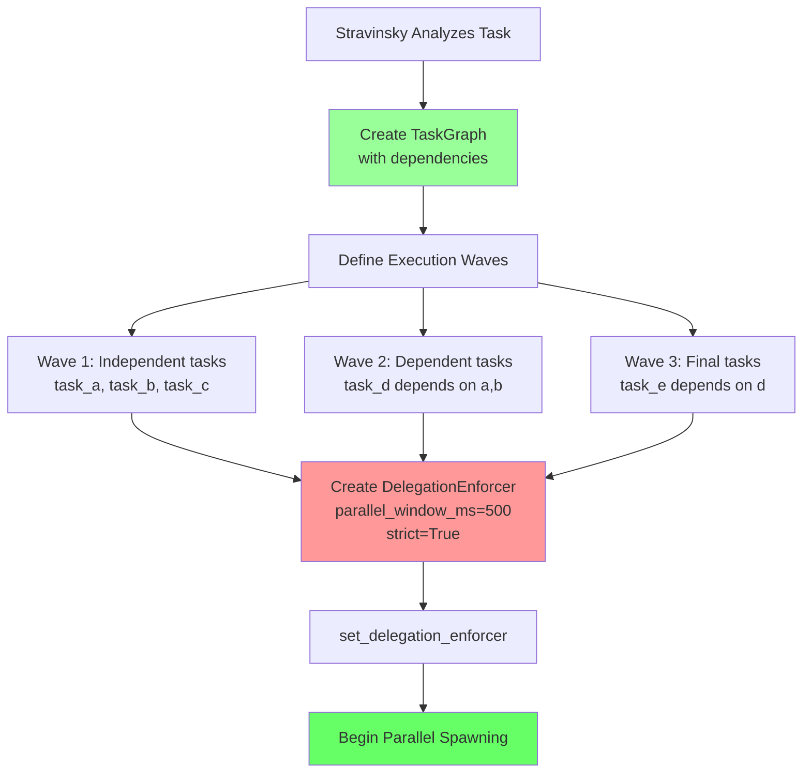
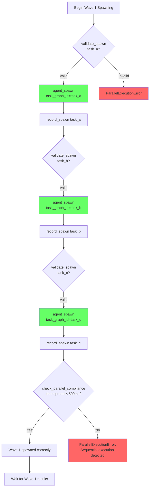
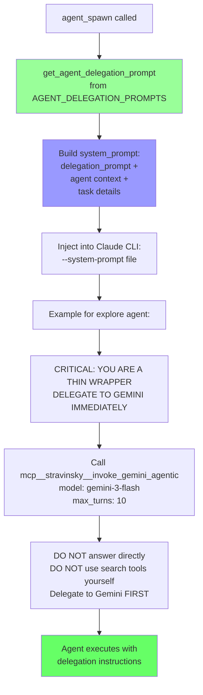
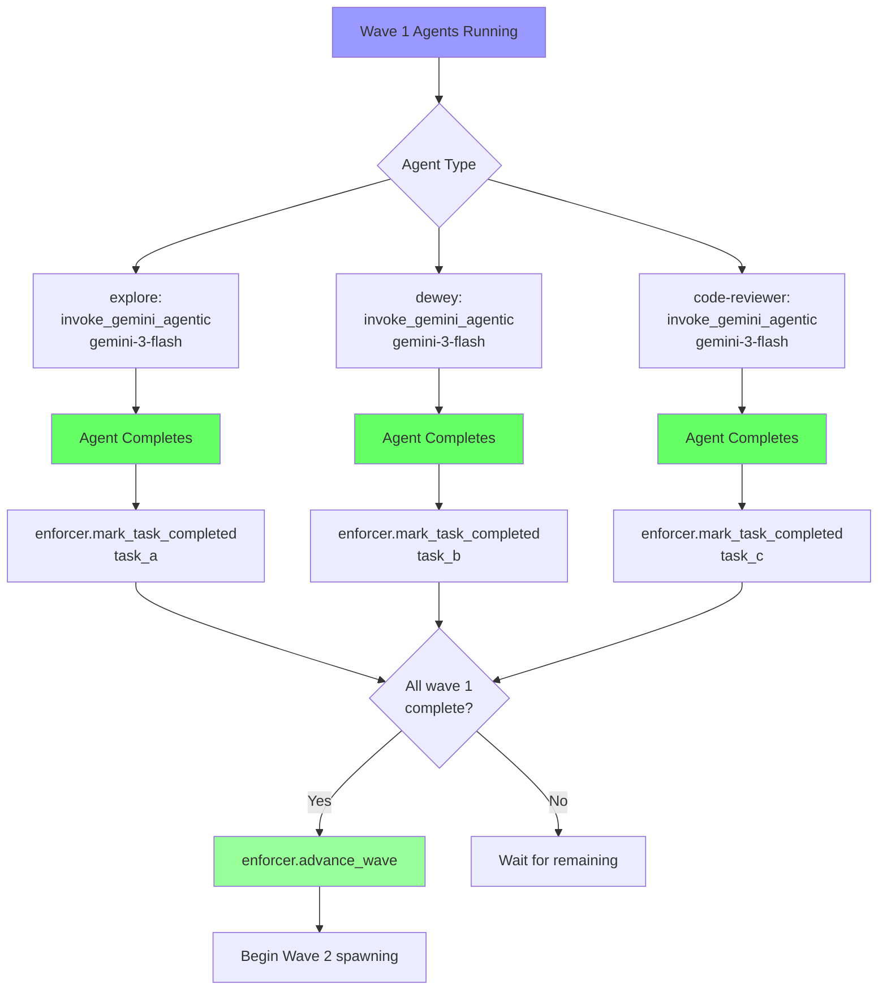
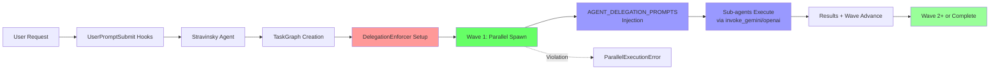

# Stravinsky Agent Workflow - Complete Process Flow

## Executive Summary

Stravinsky uses a **three-layer enforcement system** combining Claude Code's native hooks, native sub-agents, and specialized agent prompts with the new **TaskGraph** and **DelegationEnforcer** for hard parallel execution validation. This document provides the definitive flowchart showing EXACTLY how the process works from user request to agent execution.

---

## Quick Reference: Agent Types and Models

### Agent Types (13 agents)

| Agent | Display Model | Cost Tier | Delegation Target | Use Case |
|-------|---------------|-----------|-------------------|----------|
| **stravinsky** | Claude Sonnet 4.5 | Moderate | Native | Primary orchestrator |
| **explore** | gemini-3-flash | CHEAP | invoke_gemini_agentic | Codebase search, file discovery |
| **dewey** | gemini-3-flash | CHEAP | invoke_gemini_agentic | Documentation research |
| **code-reviewer** | gemini-3-flash | CHEAP | invoke_gemini_agentic | Code quality analysis |
| **momus** | gemini-3-flash | CHEAP | invoke_gemini_agentic | Quality gate validation |
| **comment_checker** | gemini-3-flash | CHEAP | invoke_gemini_agentic | Documentation completeness |
| **document_writer** | gemini-3-flash | CHEAP | invoke_gemini_agentic | Technical documentation |
| **multimodal** | gemini-3-flash | CHEAP | invoke_gemini | Visual analysis |
| **research-lead** | gemini-3-flash | CHEAP | invoke_gemini_agentic | Research coordination |
| **frontend** | gemini-3-pro-high | MEDIUM | invoke_gemini_agentic | UI/UX implementation |
| **debugger** | claude-sonnet-4.5 | MEDIUM | Native (LSP tools) | Root cause analysis |
| **implementation-lead** | claude-sonnet-4.5 | MEDIUM | Native | Execution coordination |
| **delphi** | gpt-5.2 | EXPENSIVE | invoke_openai | Strategic architecture |
| **planner** | opus-4.5 | EXPENSIVE | Native | Pre-implementation planning |

### Hook Types (15 hooks)

| Hook File | Type | Trigger | Exit Codes | Purpose |
|-----------|------|---------|-----------|----------|
| `parallel_execution.py` | UserPromptSubmit | Before response | 0 | Inject parallel instructions, activate stravinsky mode |
| `context.py` | UserPromptSubmit | Before response | 0 | Inject project context |
| `todo_continuation.py` | UserPromptSubmit | Before response | 0 | Inject incomplete TODO reminders |
| `notification_hook.py` | Notification | On notifications | 0 | Agent spawn messages (Legacy) |
| `notification_hook_v2.py` | Notification | On notifications | 0 | Enhanced agent spawn messages with colors |
| `stravinsky_mode.py` | PreToolUse | Before tool execution | 0=Allow, 2=Block | Block direct tool usage in stravinsky mode |
| `pre_compact.py` | PreCompact | Before compaction | 0 | Context preservation |
| `todo_delegation.py` | PostToolUse | After TodoWrite | 0=OK, 1=Warn, 2=Block | Enforce parallel Task spawning |
| `tool_messaging.py` | PostToolUse | After tool execution | 0 | User-friendly tool/agent messages |
| `edit_recovery.py` | PostToolUse | After Edit/MultiEdit | 0 | Edit failure recovery guidance |
| `truncator.py` | PostToolUse | After tool execution | 0 | Truncate large outputs (>30k chars) |
| `subagent_stop.py` | SubagentStop | On agent completion | 0=OK, 2=Block | Agent completion handling |
| `dependency_tracker.py` | UserPromptSubmit | Before response | 0 | Track task dependencies for smart parallelization |
| `execution_state_tracker.py` | UserPromptSubmit | Before response | 0 | Track execution state to detect sequential fallback |
| `parallel_reinforcement_v2.py`| UserPromptSubmit | Before response | 0 | Smart reinforcement of parallel delegation |
| `ralph_loop.py` | PostAssistantMessage | After response | 0 | Auto-continue incomplete work |

---

## Complete Workflow Diagrams

### Phase 1: Hook Processing and Agent Activation


### Phase 2: TaskGraph Creation and DelegationEnforcer Setup



### Phase 3: Parallel Agent Spawning with Enforcement



### Phase 4: AGENT_DELEGATION_PROMPTS Injection



### Phase 5: Agent Execution and Results Collection



### Combined: Complete Flow Summary



---

## Detailed Step-by-Step Flow

### Phase 1: User Request to Hook Processing

```
1. USER SUBMITS REQUEST
   Examples:
   - "/stravinsky implement authentication"
   - "Add dark mode to the app"
   - "ultrawork - refactor the codebase"

2. UserPromptSubmit HOOKS (Run in Parallel)

   Hook 1: parallel_execution.py
   - Detects: /stravinsky, ultrawork, ultrathink, implementation
   - Action 1: CREATE ~/.stravinsky_mode marker file
   - Action 2: INJECT parallel execution instructions to prompt
   - Output: Modified prompt with [PARALLEL EXECUTION MODE]

   Hook 2: context.py
   - Searches: AGENTS.md, README.md, CLAUDE.md
   - Action: PREPEND project context to prompt

   Hook 3: todo_continuation.py
   - Reads: .claude/todo_state.json
   - Detects: in_progress or pending TODOs
   - Action: INJECT reminder about incomplete work
```

### Phase 2: Stravinsky Activation and Task Analysis

```
3. STRAVINSKY AGENT ACTIVATED
   System Prompt Sections Loaded:
   - Phase 0: Skill gate (check skill_list first)
   - Phase 1: Intent classification
   - Phase 2: Aggressive delegation
   - Phase 2B: Parallel task execution (CRITICAL section)
   - Phase 3: Relentless completion

   Key Constraints:
   - NEVER use Read/Grep/Bash directly
   - ALWAYS delegate to specialized agents
   - Use TaskGraph for dependency management
   - All wave tasks MUST spawn within 500ms

4. STRAVINSKY ANALYZES TASK AND CREATES TASKGRAPH
   Task: "Implement authentication system"

   TaskGraph created:
   {
     "search_existing": {
       "description": "Find existing auth code",
       "agent_type": "explore",
       "depends_on": []
     },
     "research_jwt": {
       "description": "Research JWT best practices",
       "agent_type": "dewey",
       "depends_on": []
     },
     "review_design": {
       "description": "Review auth flow design",
       "agent_type": "code-reviewer",
       "depends_on": []
     },
     "implement_auth": {
       "description": "Implement auth endpoints",
       "agent_type": "frontend",
       "depends_on": ["search_existing", "research_jwt", "review_design"]
     }
   }

   Waves computed:
   - Wave 1: [search_existing, research_jwt, review_design] <- PARALLEL
   - Wave 2: [implement_auth] <- SEQUENTIAL (depends on wave 1)
```

### Phase 3: DelegationEnforcer Setup

```
5. DELEGATIONENFORCER CREATED

   from mcp_bridge.orchestrator.task_graph import TaskGraph, DelegationEnforcer
   from mcp_bridge.tools.agent_manager import set_delegation_enforcer

   graph = TaskGraph.from_dict(task_dict)
   enforcer = DelegationEnforcer(
       task_graph=graph,
       parallel_window_ms=500,  # 500ms window for parallel spawns
       strict=True              # Raise errors on violations
   )

   set_delegation_enforcer(enforcer)

   Enforcer initialized with 2 execution waves:
   - Wave 1: [search_existing, research_jwt, review_design]
   - Wave 2: [implement_auth]
```

### Phase 4: Parallel Agent Spawning

```
6. WAVE 1 PARALLEL SPAWNING (ALL within 500ms)

   # Spawn 1: explore agent
   is_valid, error = enforcer.validate_spawn("search_existing")
   # Returns: (True, None)

   task_id_1 = await agent_spawn(
       prompt="Find existing auth implementations",
       agent_type="explore",
       task_graph_id="search_existing"
   )
   # AGENT_DELEGATION_PROMPTS["explore"] injected as system prompt
   # Timestamp recorded: T+0ms

   # Spawn 2: dewey agent
   is_valid, error = enforcer.validate_spawn("research_jwt")
   # Returns: (True, None)

   task_id_2 = await agent_spawn(
       prompt="Research JWT best practices",
       agent_type="dewey",
       task_graph_id="research_jwt"
   )
   # AGENT_DELEGATION_PROMPTS["dewey"] injected
   # Timestamp recorded: T+150ms

   # Spawn 3: code-reviewer agent
   is_valid, error = enforcer.validate_spawn("review_design")
   # Returns: (True, None)

   task_id_3 = await agent_spawn(
       prompt="Review auth flow design",
       agent_type="code-reviewer",
       task_graph_id="review_design"
   )
   # AGENT_DELEGATION_PROMPTS["code-reviewer"] injected
   # Timestamp recorded: T+300ms

   # Compliance check
   is_compliant, error = enforcer.check_parallel_compliance()
   # Time spread: 300ms < 500ms limit
   # Returns: (True, None) - PARALLEL EXECUTION VERIFIED

7. IF SEQUENTIAL SPAWN ATTEMPTED (BLOCKED)

   # Example: Response ends, next response tries to spawn

   task_id_2 = await agent_spawn(
       prompt="Research JWT...",
       agent_type="dewey",
       task_graph_id="research_jwt"
   )
   # Timestamp: T+10000ms (10 seconds later)

   # Compliance check FAILS
   is_compliant, error = enforcer.check_parallel_compliance()
   # Time spread: 10000ms > 500ms limit
   # Raises: ParallelExecutionError(
   #   "Tasks in wave were not spawned in parallel. "
   #   "Time spread: 10000ms > 500ms limit. "
   #   "Independent tasks MUST be spawned simultaneously."
   # )
```

### Phase 5: Agent Execution with Delegation Prompts

```
8. AGENTS EXECUTE WITH DELEGATION PROMPTS

   Each agent receives AGENT_DELEGATION_PROMPTS[agent_type]:

   explore agent receives:
   ---
   ## CRITICAL: YOU ARE A THIN WRAPPER - DELEGATE TO GEMINI IMMEDIATELY

   You are the Explore agent. Your ONLY job is to delegate ALL work
   to Gemini Flash with full tool access.

   **IMMEDIATELY** call `mcp__stravinsky__invoke_gemini_agentic` with:
   - **model**: `gemini-3-flash`
   - **prompt**: The complete task description, plus instructions to use
     search tools (semantic_search, grep_search, ast_grep_search)
   - **max_turns**: 10

   **DO NOT** answer directly. **DO NOT** use search tools yourself.
   Delegate to Gemini FIRST, then return Gemini's response.
   ---

   dewey agent receives similar prompt targeting gemini-3-flash

   code-reviewer agent receives similar prompt with lsp_diagnostics focus

9. AGENTS CALL EXTERNAL MODELS

   explore agent calls:
     mcp__stravinsky__invoke_gemini_agentic(
       model="gemini-3-flash",
       prompt="Search the codebase for auth implementations using
               available tools (grep_search, ast_grep_search,
               semantic_search, glob_files)...",
       max_turns=10
     )

   Gemini executes with tool access:
   - grep_search("jwt", "src/")
   - ast_grep_search("def.*token", "python")
   - semantic_search("authentication flow")

   Results returned through explore agent to orchestrator
```

### Phase 6: Results Collection and Wave Advancement

```
10. RESULTS COLLECTED AND WAVE ADVANCED

    # As agents complete:
    result_1 = await agent_output(task_id_1, block=True)
    enforcer.mark_task_completed("search_existing")

    result_2 = await agent_output(task_id_2, block=True)
    enforcer.mark_task_completed("research_jwt")

    result_3 = await agent_output(task_id_3, block=True)
    enforcer.mark_task_completed("review_design")

    # All wave 1 tasks complete - automatic advance
    # enforcer.advance_wave() called internally

    # Wave 2 now available
    current_wave = enforcer.get_current_wave()
    # Returns: [Task(id="implement_auth", ...)]

11. WAVE 2 EXECUTION

    is_valid, error = enforcer.validate_spawn("implement_auth")
    # Returns: (True, None) - dependencies satisfied

    task_id_4 = await agent_spawn(
        prompt=f"""Implement auth based on research:
        - Existing code: {result_1}
        - JWT practices: {result_2}
        - Design review: {result_3}""",
        agent_type="frontend",
        task_graph_id="implement_auth"
    )
    # AGENT_DELEGATION_PROMPTS["frontend"] injected
    # Delegates to gemini-3-pro via invoke_gemini_agentic

12. COMPLETION AND CLEANUP

    result_4 = await agent_output(task_id_4, block=True)
    enforcer.mark_task_completed("implement_auth")

    # All waves complete
    clear_delegation_enforcer()

    # Final verification
    lsp_diagnostics(file_paths=[...])
    # Run tests
    # Mark task complete
```

---

## Agent Delegation Prompts Reference

### AGENT_DELEGATION_PROMPTS Dictionary

Location: `mcp_bridge/tools/agent_manager.py`

```python
AGENT_DELEGATION_PROMPTS = {
    "explore": """## CRITICAL: YOU ARE A THIN WRAPPER - DELEGATE TO GEMINI IMMEDIATELY

    You are the Explore agent. Your ONLY job is to delegate ALL work to Gemini Flash...
    **IMMEDIATELY** call `mcp__stravinsky__invoke_gemini_agentic` with:
    - **model**: `gemini-3-flash`
    - **max_turns**: 10
    ...""",

    "dewey": """## CRITICAL: YOU ARE A THIN WRAPPER - DELEGATE TO GEMINI IMMEDIATELY

    You are the Dewey agent - a documentation and research specialist.
    **IMMEDIATELY** call `mcp__stravinsky__invoke_gemini_agentic`...""",

    "delphi": """## CRITICAL: YOU ARE A THIN WRAPPER - DELEGATE TO OPENAI/GPT IMMEDIATELY

    You are the Delphi agent - a strategic technical advisor.
    **IMMEDIATELY** call `mcp__stravinsky__invoke_openai` with:
    - **model**: `gpt-5.2-codex`
    - **reasoning_effort**: `high`
    ...""",

    "frontend": """## CRITICAL: YOU ARE A THIN WRAPPER - DELEGATE TO GEMINI PRO IMMEDIATELY

    You are the Frontend agent - a UI/UX implementation specialist.
    **IMMEDIATELY** call `mcp__stravinsky__invoke_gemini_agentic` with:
    - **model**: `gemini-3-pro`
    ...""",

    "code-reviewer": """## CRITICAL: YOU ARE A THIN WRAPPER - DELEGATE TO GEMINI IMMEDIATELY

    You are the Code Reviewer agent...
    Use lsp_diagnostics and ast_grep_search...""",

    "debugger": """## YOU ARE A DEBUGGING SPECIALIST

    Use your available tools (lsp_diagnostics, lsp_hover, ast_grep_search)...""",

    "momus": """## CRITICAL: YOU ARE A THIN WRAPPER - DELEGATE TO GEMINI IMMEDIATELY

    You are the Momus agent - a quality gate validator...""",

    "document_writer": """## CRITICAL: YOU ARE A THIN WRAPPER - DELEGATE TO GEMINI IMMEDIATELY

    You are the Document Writer agent - technical documentation specialist...""",

    "multimodal": """## CRITICAL: YOU ARE A THIN WRAPPER - DELEGATE TO GEMINI IMMEDIATELY

    You are the Multimodal agent - visual analysis specialist.
    Note: Use `invoke_gemini` (not agentic) for pure visual analysis...""",

    "comment_checker": """## CRITICAL: YOU ARE A THIN WRAPPER - DELEGATE TO GEMINI IMMEDIATELY

    You are the Comment Checker agent - documentation completeness validator...""",
}
```

### Default Delegation Prompt

For unknown agent types:

```python
DEFAULT_DELEGATION_PROMPT = """## AGENT DELEGATION AVAILABLE

You have access to Stravinsky MCP tools for model delegation:

- `mcp__stravinsky__invoke_gemini_agentic`: Delegate to Gemini with tool access
- `mcp__stravinsky__invoke_gemini`: Delegate to Gemini for simple tasks
- `mcp__stravinsky__invoke_openai`: Delegate to OpenAI/GPT for complex reasoning

Use these tools when appropriate for your task."""
```

---

## TaskGraph and DelegationEnforcer API

### TaskGraph Creation

```python
from mcp_bridge.orchestrator.task_graph import TaskGraph, Task, TaskStatus

# From dictionary
graph = TaskGraph.from_dict({
    "task_a": {"description": "...", "agent_type": "explore", "depends_on": []},
    "task_b": {"description": "...", "agent_type": "dewey", "depends_on": []},
    "task_c": {"description": "...", "agent_type": "frontend", "depends_on": ["task_a", "task_b"]}
})

# Programmatically
graph = TaskGraph()
graph.add_task("task_a", "Description", "explore", dependencies=[])
graph.add_task("task_b", "Description", "dewey", dependencies=[])
graph.add_task("task_c", "Description", "frontend", dependencies=["task_a", "task_b"])

# Get execution waves
waves = graph.get_independent_groups()
# Returns: [[task_a, task_b], [task_c]]

# Get ready tasks (no pending dependencies)
ready = graph.get_ready_tasks()
```

### DelegationEnforcer Usage

```python
from mcp_bridge.orchestrator.task_graph import DelegationEnforcer, ParallelExecutionError

# Create enforcer
enforcer = DelegationEnforcer(
    task_graph=graph,
    parallel_window_ms=500,  # Max time between parallel spawns
    strict=True              # Raise errors on violations
)

# Validate spawn is allowed
is_valid, error = enforcer.validate_spawn("task_id")
if not is_valid:
    raise ParallelExecutionError(error)

# Record spawn timing
enforcer.record_spawn("task_id", "agent_abc123")

# Check parallel compliance after wave
is_compliant, error = enforcer.check_parallel_compliance()

# Mark task completed
enforcer.mark_task_completed("task_id")

# Advance to next wave
has_more = enforcer.advance_wave()

# Get enforcement status
status = enforcer.get_enforcement_status()
# {
#     "current_wave": 1,
#     "total_waves": 2,
#     "current_wave_tasks": ["task_a", "task_b"],
#     "spawn_batch": [("task_a", 1642000000.5)],
#     "task_statuses": {"task_a": "spawned", "task_b": "pending"}
# }
```

### Global Enforcer Management

```python
from mcp_bridge.tools.agent_manager import (
    set_delegation_enforcer,
    clear_delegation_enforcer,
    get_delegation_enforcer
)

# Activate during DELEGATE phase
set_delegation_enforcer(enforcer)

# Get current enforcer
current = get_delegation_enforcer()

# Clear after execution complete
clear_delegation_enforcer()
```

---

## Agent Invocation Decision Matrix

### When Stravinsky Delegates to Specialists

| Trigger Condition | Agent | Cost Tier | Delegation Target |
|------------------|-------|-----------|-------------------|
| Task contains "find", "search", "where is" | **explore** | CHEAP | gemini-3-flash |
| Task contains "research", "documentation" | **dewey** | CHEAP | gemini-3-flash |
| Task contains "review", "security", "quality" | **code-reviewer** | CHEAP | gemini-3-flash |
| Task contains "validate", "gate", "check" | **momus** | CHEAP | gemini-3-flash |
| Task contains "missing docs", "undocumented" | **comment_checker** | CHEAP | gemini-3-flash |
| Task contains "write docs", "document" | **document_writer** | CHEAP | gemini-3-flash |
| Task contains "analyze image", "screenshot" | **multimodal** | CHEAP | gemini-3-flash |
| Task involves "UI", "frontend", "styling" | **frontend** | MEDIUM | gemini-3-pro |
| 2+ consecutive fix attempts failed | **debugger** | MEDIUM | Native (LSP) |
| 3+ failures OR architecture decisions | **delphi** | EXPENSIVE | gpt-5.2-codex |
| Need implementation plan before coding | **planner** | EXPENSIVE | Native (Opus) |

### Cost-Based Execution Strategy

```
CHEAP tier (AGENT_COST_TIERS) - Use liberally:
- explore       (gemini-3-flash)
- dewey         (gemini-3-flash)
- code-reviewer (gemini-3-flash)
- momus         (gemini-3-flash)
- comment_checker (gemini-3-flash)
- document_writer (gemini-3-flash)
- multimodal    (gemini-3-flash)
- research-lead (gemini-3-flash)

MEDIUM tier - Use when needed:
- frontend      (gemini-3-pro-high)
- debugger      (claude-sonnet-4.5)
- implementation-lead (claude-sonnet-4.5)

EXPENSIVE tier - Use sparingly:
- delphi        (gpt-5.2)
- planner       (opus-4.5)
```

---

## Error Handling and Recovery

### ParallelExecutionError

```python
from mcp_bridge.orchestrator.task_graph import ParallelExecutionError

try:
    await agent_spawn(..., task_graph_id="task_c")
except ParallelExecutionError as e:
    # Handle: task has unmet dependencies
    # Or: tasks not spawned in parallel
    logger.error(f"Parallel violation: {e}")
```

### Common Error Scenarios

| Scenario | Error Message | Recovery |
|----------|---------------|----------|
| Spawn before dependencies | "Task X has unmet dependencies" | Wait for wave N-1 to complete |
| Sequential spawns | "Time spread Xms > 500ms limit" | Spawn all wave tasks in same response |
| Unknown task | "Unknown task: X" | Verify task_graph_id matches TaskGraph |
| Wave 2 before wave 1 | "Task X not found in any wave" | Complete wave 1 first |

---

## Performance Metrics

### Typical Execution Times

| Operation | Time | Notes |
|-----------|------|-------|
| TaskGraph creation | <10ms | Dictionary parsing |
| DelegationEnforcer init | <5ms | Wave computation |
| validate_spawn | <1ms | In-memory lookup |
| record_spawn | <1ms | Timestamp recording |
| check_parallel_compliance | <1ms | Time spread calculation |
| agent_spawn (non-blocking) | <200ms | CLI subprocess start |
| explore agent (gemini-3-flash) | 5-30s | Depends on search scope |
| dewey agent (gemini-3-flash) | 10-60s | Web research |
| code-reviewer (gemini-3-flash) | 5-20s | Static analysis |
| frontend (gemini-3-pro) | 20-90s | UI generation |
| delphi (gpt-5.2) | 60-180s | Strategic analysis |

### Parallel Speedup

**Sequential (OLD approach)**:
```
Search (30s) -> Research (60s) -> Review (20s) = 110s total
```

**Parallel with DelegationEnforcer**:
```
Search (30s)  |
Research (60s)| ALL CONCURRENT = 60s total (slowest task)
Review (20s)  |
```

**Speedup**: 110s -> 60s (45% faster)

---

## Key Takeaways

1. **AGENT_DELEGATION_PROMPTS**: Dictionary of full delegation prompts injected at spawn time for cross-repo MCP compatibility

2. **10 specialized agents**: explore, dewey, delphi, frontend, code-reviewer, debugger, momus, document_writer, multimodal, comment_checker

3. **Model routing**: CHEAP tier uses gemini-3-flash, MEDIUM uses gemini-3-pro or sonnet, EXPENSIVE uses gpt-5.2 or opus

4. **TaskGraph**: DAG for dependency tracking with wave-based execution

5. **DelegationEnforcer**: Hard enforcement of parallel execution within 500ms window

6. **task_graph_id parameter**: Links agent_spawn to TaskGraph for validation

7. **Thin wrapper pattern**: Agents delegate to external models via invoke_gemini_agentic or invoke_openai

8. **Hierarchy enforcement**: Orchestrators can spawn any agent, workers cannot spawn workers

---

## Files Reference

### Core Implementation Files

- `mcp_bridge/tools/agent_manager.py` - AgentManager, AGENT_DELEGATION_PROMPTS, spawn functions
- `mcp_bridge/orchestrator/task_graph.py` - TaskGraph, DelegationEnforcer, ParallelExecutionError

### Configuration Dictionaries

- `AGENT_MODEL_ROUTING` - CLI model override per agent type
- `AGENT_COST_TIERS` - Cost classification (CHEAP/MEDIUM/EXPENSIVE)
- `AGENT_DISPLAY_MODELS` - Display model names for UI
- `AGENT_TOOLS` - Allowed tools per agent type
- `ORCHESTRATOR_AGENTS` - List of orchestrator agent types
- `WORKER_AGENTS` - List of worker agent types

---

**Document Version**: 2.0
**Last Updated**: 2026-01-22
**Status**: Updated for TaskGraph and DelegationEnforcer architecture
