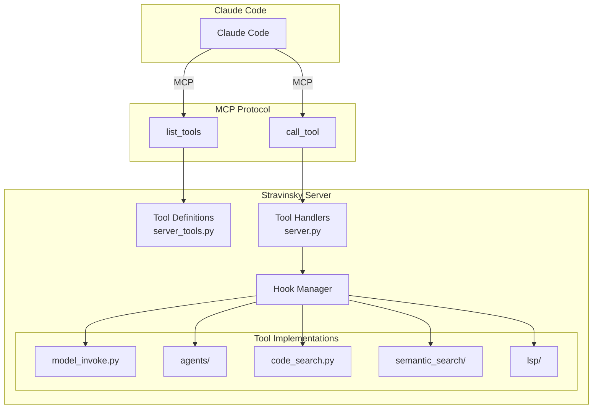
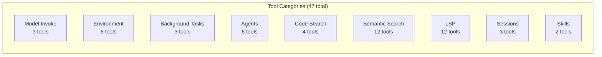
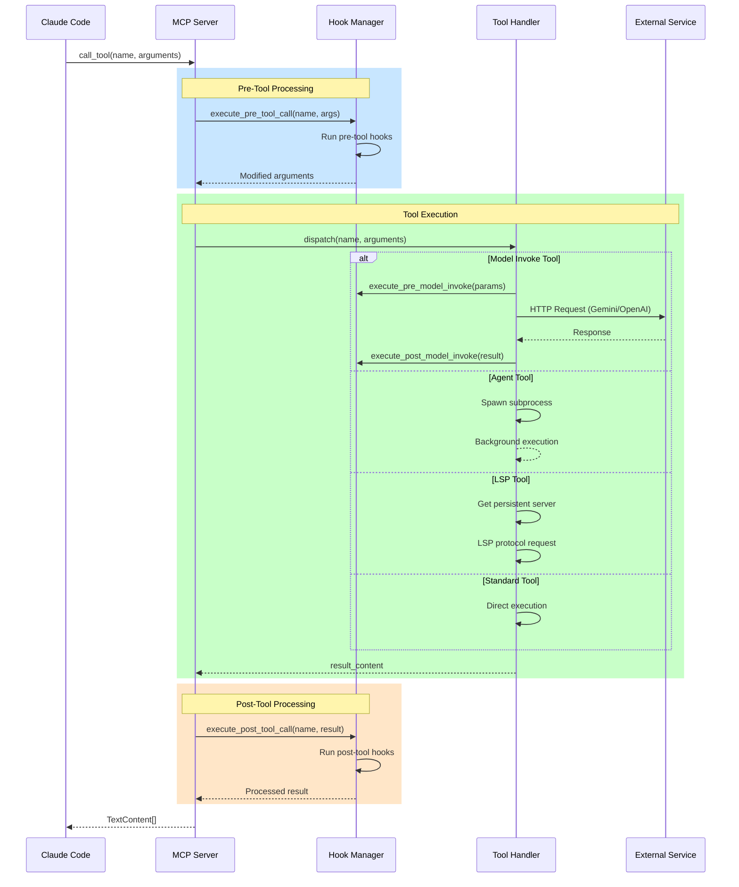

# MCP Tool Invocation Flow

This document details how tools are registered, invoked, and processed in Stravinsky's MCP server.

## Overview

Stravinsky implements 47 MCP tools across 8 categories. Each tool follows a consistent invocation pattern with hooks for pre/post processing.



## Tool Registration

### Tool Metadata Structure

Each tool is defined in `server_tools.py` with JSON Schema validation:

```python
Tool(
    name="invoke_gemini",
    description="Invoke a Gemini model with the given prompt...",
    inputSchema={
        "type": "object",
        "properties": {
            "prompt": {"type": "string", "description": "The prompt to send"},
            "model": {"type": "string", "default": "gemini-3-flash"},
            "max_tokens": {"type": "integer", "default": 8192},
            "temperature": {"type": "number", "default": 0.7},
            "agent_context": {
                "type": "object",
                "properties": {
                    "agent_type": {"type": "string"},
                    "task_id": {"type": "string"},
                    "description": {"type": "string"}
                }
            }
        },
        "required": ["prompt"]
    }
)
```

### Tool Categories



## Invocation Flow

### Complete Request Lifecycle



### Dispatch Logic

```python
# server.py call_tool() dispatch pattern
@server.call_tool()
async def call_tool(name: str, arguments: dict) -> list[TextContent]:
    hook_manager = get_hook_manager_lazy()

    # Pre-tool hooks
    arguments = await hook_manager.execute_pre_tool_call(name, arguments)

    # Dispatch by name
    if name == "invoke_gemini":
        from .tools.model_invoke import invoke_gemini
        result = await invoke_gemini(
            prompt=arguments["prompt"],
            model=arguments.get("model", "gemini-3-flash"),
            # ... other params
        )
    elif name == "agent_spawn":
        from .tools.agents import spawn_agent
        result = await spawn_agent(...)
    elif name.startswith("lsp_"):
        from .tools.lsp import get_lsp_tool
        tool_fn = get_lsp_tool(name)
        result = await tool_fn(**arguments)
    # ... more tools

    # Post-tool hooks
    result = await hook_manager.execute_post_tool_call(name, result)

    return [TextContent(type="text", text=result)]
```

## Model Invocation Details

### invoke_gemini Flow


### Agent Context Propagation


Example context usage:
```python
await invoke_gemini(
    prompt="Find authentication code",
    agent_context={
        "agent_type": "explore",
        "task_id": "agent_abc123",
        "description": "Search for auth patterns"
    }
)

# Logged as:
# [explore] → gemini-3-flash: Find authentication code...
```

## Rate Limiting Architecture

### Concurrency Control

```mermaid
flowchart TB
    subgraph "Per-Model Semaphores"
        S1[gemini-3-flash<br/>Semaphore(10)]
        S2[gemini-3-pro<br/>Semaphore(5)]
        S3[gemini-3-pro-high<br/>Semaphore(3)]
    end

    subgraph "Time-Window Limiter"
        TL[30 requests/minute<br/>global limit]
    end

    REQ1[Request 1] --> S1
    REQ2[Request 2] --> S1
    REQ3[Request 3] --> S2

    S1 --> TL
    S2 --> TL
    S3 --> TL

    TL --> OUT[HTTP Request]
```

### Rate Limit Configuration

```python
# Default semaphore limits
SEMAPHORE_LIMITS = {
    "gemini-3-flash": 10,
    "gemini-3-pro": 5,
    "gemini-3-pro-high": 3,
    "gpt-5.2": 3,
}

# Time-window limit
REQUESTS_PER_MINUTE = 30
```

## Error Handling

### Retry Strategy


### Backoff Timing

```python
# Retry configuration
retry = tenacity.retry(
    stop=stop_after_attempt(2),           # Max 2 attempts
    wait=wait_exponential(multiplier=10), # 10s → 20s → 40s
    retry=retry_if_result(is_retryable),  # Only 5xx errors
)
```

## Tool Categories Reference

### Model Invoke (3 tools)

| Tool | Model | Purpose |
|------|-------|---------|
| `invoke_gemini` | Gemini 3 Flash/Pro | General text generation |
| `invoke_gemini_agentic` | Gemini 3 Flash | Agentic loop with tools |
| `invoke_openai` | GPT-5.2 | Complex reasoning |

### Agent Tools (6 tools)

| Tool | Purpose |
|------|---------|
| `agent_spawn` | Launch background agent |
| `agent_output` | Get agent results |
| `agent_progress` | Real-time progress |
| `agent_cancel` | Cancel running agent |
| `agent_list` | List all agents |
| `agent_retry` | Retry failed agent |

### LSP Tools (12 tools)

| Tool | LSP Method | Purpose |
|------|-----------|---------|
| `lsp_hover` | `textDocument/hover` | Type info at position |
| `lsp_goto_definition` | `textDocument/definition` | Jump to definition |
| `lsp_find_references` | `textDocument/references` | Find all usages |
| `lsp_document_symbols` | `textDocument/documentSymbol` | File outline |
| `lsp_workspace_symbols` | `workspace/symbol` | Search symbols |
| `lsp_prepare_rename` | `textDocument/prepareRename` | Validate rename |
| `lsp_rename` | `textDocument/rename` | Rename symbol |
| `lsp_code_actions` | `textDocument/codeAction` | Quick fixes |
| `lsp_code_action_resolve` | N/A (ruff) | Apply fix |
| `lsp_extract_refactor` | N/A (jedi) | Extract function |
| `lsp_servers` | N/A | List servers |
| `lsp_diagnostics` | N/A (ruff/tsc) | File diagnostics |

### Semantic Search (12 tools)

| Tool | Purpose |
|------|---------|
| `semantic_search` | Natural language code search |
| `hybrid_search` | Semantic + AST search |
| `semantic_index` | Index codebase |
| `semantic_stats` | Index statistics |
| `multi_query_search` | LLM-expanded queries |
| `decomposed_search` | Break complex queries |
| `enhanced_search` | Auto-select strategy |
| `start_file_watcher` | Auto-reindex on change |
| `stop_file_watcher` | Stop watching |
| `list_file_watchers` | List active watchers |
| `cancel_indexing` | Cancel ongoing index |
| `delete_index` | Remove index |

## Lazy Loading Pattern

All tool implementations use lazy imports to minimize startup time:

```python
# Instead of top-level imports
# from .tools.model_invoke import invoke_gemini  # ❌

# Tools are imported only when called
if name == "invoke_gemini":
    from .tools.model_invoke import invoke_gemini  # ✅
    result = await invoke_gemini(...)
```

This reduces initial memory footprint and speeds up MCP server startup.

## Related Documentation

- [Architecture Overview](ARCHITECTURE.md)
- [OAuth Flow](OAUTH_FLOW.md)
- [Agent Orchestration](AGENT_ORCHESTRATION.md)
- [LSP Architecture](LSP_ARCHITECTURE.md)
