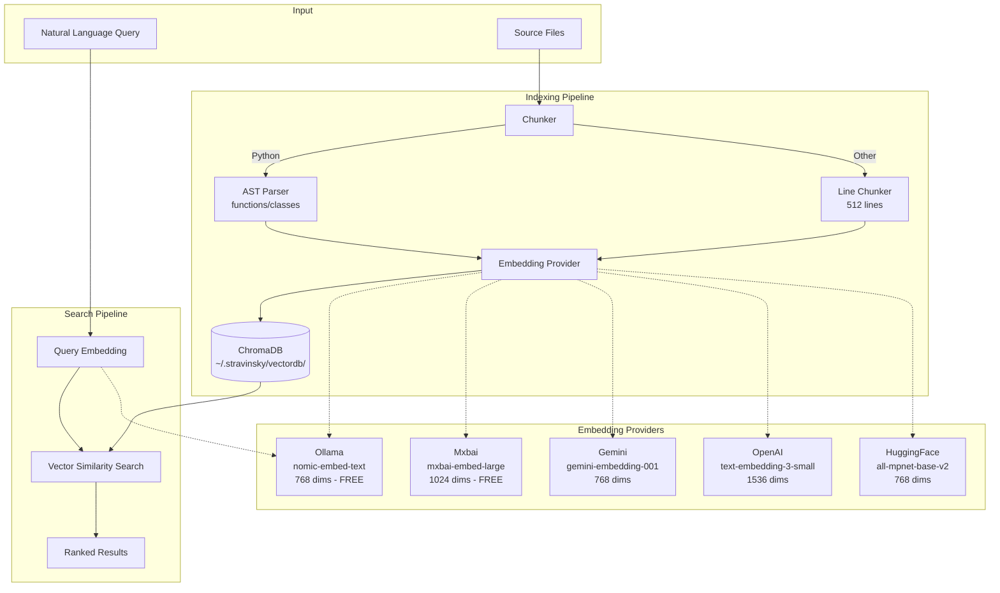
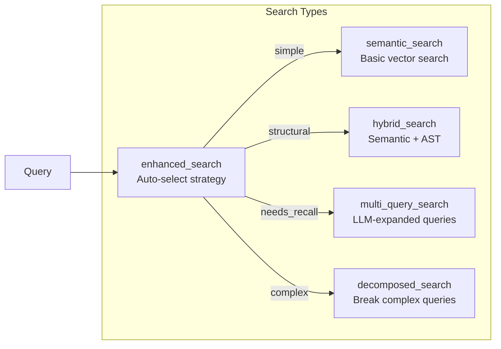

# Semantic Search Quick Start Guide

Semantic search enables natural language queries like "find authentication logic" without requiring exact pattern matching. This guide helps you get started in minutes.

## Architecture Overview



## Quick Setup (3 Steps)

### Step 1: Install an Embedding Provider

**Option A: Ollama (Local, Free) - Recommended**

```bash
# Install Ollama
brew install ollama

# Start the service
ollama serve

# Pull the embedding model
ollama pull nomic-embed-text
```

**Option B: Mxbai (Local, Free, Better for Code)**

```bash
# After installing Ollama
ollama pull mxbai-embed-large
```

**Option C: Cloud Providers (OAuth)**

```bash
# Gemini (free tier available)
stravinsky-auth login gemini

# OpenAI (requires subscription)
stravinsky-auth login openai
```

**Option D: HuggingFace (Token-based)**

```bash
# Set token
export HF_TOKEN="your_hf_token"
# or
huggingface-cli login
```

### Step 2: Index Your Codebase

```python
from mcp_bridge.tools.semantic_search import index_codebase

# Index with default provider (ollama)
result = await index_codebase(project_path=".")
print(result)

# Index with specific provider
result = await index_codebase(project_path=".", provider="mxbai")
```

### Step 3: Search

```python
from mcp_bridge.tools.semantic_search import semantic_search

# Basic search
results = await semantic_search(
    query="authentication logic",
    project_path=".",
    n_results=10
)
print(results)
```

## Available Search Tools

| Tool | Purpose | When to Use |
|------|---------|-------------|
| `semantic_search` | Basic natural language search | Simple conceptual queries |
| `hybrid_search` | Semantic + AST pattern matching | Need both meaning and structure |
| `enhanced_search` | Auto-selects best strategy | Unsure which approach fits |
| `multi_query_search` | LLM-expanded query variations | Need better recall |
| `decomposed_search` | Breaks complex queries apart | Multi-part queries |

## Search Tool Reference

### semantic_search

Core natural language code search.

```python
async def semantic_search(
    query: str,                              # Natural language query
    project_path: str = ".",                 # Project root
    n_results: int = 10,                     # Max results
    language: str | None = None,             # Filter: "py", "ts", "js"
    node_type: str | None = None,            # Filter: "function", "class", "method"
    decorator: str | None = None,            # Filter: "@property", "@staticmethod"
    is_async: bool | None = None,            # Filter: async functions only
    base_class: str | None = None,           # Filter: by base class
    provider: EmbeddingProvider = "ollama"   # Embedding provider
) -> str
```

**Example:**

```python
results = await semantic_search(
    query="how does the system validate user input",
    project_path=".",
    language="py",
    node_type="function",
    n_results=5
)
```

### hybrid_search

Combines semantic similarity with structural AST matching.

```python
async def hybrid_search(
    query: str,                          # Natural language query
    pattern: str | None = None,          # ast-grep pattern (optional)
    project_path: str = ".",
    n_results: int = 10,
    language: str | None = None,
    node_type: str | None = None,
    decorator: str | None = None,
    is_async: bool | None = None,
    base_class: str | None = None,
    provider: EmbeddingProvider = "ollama"
) -> str
```

**Example:**

```python
# Find async functions that handle authentication
results = await hybrid_search(
    query="user authentication and token validation",
    pattern="async def $FUNC($$$):",
    language="py",
    is_async=True
)
```

### enhanced_search

Auto-selects the best search strategy based on query complexity.

```python
async def enhanced_search(
    query: str,                      # Search query
    project_path: str = ".",
    n_results: int = 10,
    mode: str = "auto",              # "auto", "expand", "decompose", "both"
    language: str | None = None,
    node_type: str | None = None,
    provider: EmbeddingProvider = "ollama"
) -> str
```

**Mode selection:**
- `auto`: Classifier picks best mode based on query complexity
- `expand`: Generate query variations for better recall
- `decompose`: Break multi-part queries into sub-searches
- `both`: Decompose first, then expand each sub-query

### multi_query_search

Expands queries using LLM for better recall.

```python
async def multi_query_search(
    query: str,                      # Original query
    project_path: str = ".",
    n_results: int = 10,
    num_expansions: int = 3,         # Number of variations
    language: str | None = None,
    node_type: str | None = None,
    provider: EmbeddingProvider = "ollama"
) -> str
```

**Example:**

```python
# "caching strategy" expands to:
# - "cache implementation"
# - "memoization"
# - "redis client"
results = await multi_query_search(
    query="caching strategy",
    num_expansions=5,
    n_results=15
)
```

### decomposed_search

Breaks complex multi-part queries into focused sub-searches.

```python
async def decomposed_search(
    query: str,                      # Complex query
    project_path: str = ".",
    n_results: int = 10,
    language: str | None = None,
    node_type: str | None = None,
    provider: EmbeddingProvider = "ollama"
) -> str
```

**Example:**

```python
# "oauth token generation, refresh, and logout" splits into:
# - "oauth token generation"
# - "token refresh"
# - "logout handling"
results = await decomposed_search(
    query="oauth token generation, refresh, and logout handling",
    n_results=20
)
```

## Index Management

### Check Index Status

```python
from mcp_bridge.tools.semantic_search import semantic_stats, semantic_health

# Get statistics
stats = await semantic_stats(project_path=".", provider="ollama")
print(stats)

# Check health
health = await semantic_health(project_path=".", provider="ollama")
print(health)
```

### Delete Index

```python
from mcp_bridge.tools.semantic_search import delete_index

# Delete specific provider index
result = delete_index(project_path=".", provider="ollama")

# Delete all providers for project
result = delete_index(project_path=".")

# Delete ALL indexes for ALL projects
result = delete_index(delete_all=True)
```

### Cancel Indexing

```python
from mcp_bridge.tools.semantic_search import cancel_indexing

# Request cancellation (happens between batches)
result = cancel_indexing(project_path=".", provider="ollama")
```

## File Watcher (Auto-Reindexing)

The file watcher automatically reindexes when code changes.

```python
from mcp_bridge.tools.semantic_search import (
    start_file_watcher,
    stop_file_watcher,
    list_file_watchers,
)

# Start watching (auto-starts on first search)
watcher = await start_file_watcher(
    project_path=".",
    provider="ollama",
    debounce_seconds=2.0
)

# Check active watchers
watchers = list_file_watchers()
for w in watchers:
    print(f"{w['project_path']}: {w['status']}")

# Stop watching
stopped = stop_file_watcher(project_path=".")
```

## Provider Comparison

| Provider | Type | Speed | Cost | Quality | Best For |
|----------|------|-------|------|---------|----------|
| **ollama** (nomic-embed-text) | Local | Fast | Free | Good | Development, quick iteration |
| **mxbai** (mxbai-embed-large) | Local | Medium | Free | Better | Code-focused searches |
| **gemini** | Cloud | Medium | Free tier | Excellent | Production, high quality |
| **openai** | Cloud | Medium | Paid | Excellent | Complex queries |
| **huggingface** | Cloud | Slow | Free tier | Good | Budget searches |

## Common Issues

### "Embedding service not available"

**For Ollama:**
```bash
ollama serve
ollama pull nomic-embed-text
```

**For Gemini/OpenAI:**
```bash
stravinsky-auth status
stravinsky-auth login gemini
```

### "No documents indexed"

```python
# Index the codebase first
await index_codebase(project_path=".")
```

### Slow searches

- Use local provider (`ollama` or `mxbai`) for development
- Reduce `n_results` to limit result set
- Add `language` filter to narrow scope

## Advanced Search Types



## File Watcher Architecture

```mermaid
flowchart TB
    subgraph "File Watcher"
        OBS[watchdog Observer]
        EVT[File Change Event<br/>create/modify/delete]
        DEB[Debounce Timer<br/>2 seconds]
    end

    subgraph "Indexing Worker"
        WK[Dedicated Thread]
        IDX[index_codebase()]
    end

    OBS -->|monitors| SF[Source Files]
    SF -->|changes| EVT
    EVT --> DEB
    DEB -->|batch| WK
    WK --> IDX
    IDX --> DB[(ChromaDB)]
```

## Next Steps

1. **Better Coverage**: Try `mxbai` provider for improved code understanding
2. **Auto-Updates**: File watcher starts automatically on first search
3. **Filtering**: Use `language`, `node_type`, `decorator` filters for precision
4. **Monitoring**: Use `semantic_health()` before critical searches

## Documentation Links

- [Best Practices Guide](./SEMANTIC_SEARCH_BEST_PRACTICES.md)
- [File Watcher Usage](./SEMANTIC_WATCHER_USAGE.md)
- [Indexing Quick Start](./semantic_indexing_quick_start.md)

---

**Last Updated**: January 2026
**Status**: All features functional and tested
