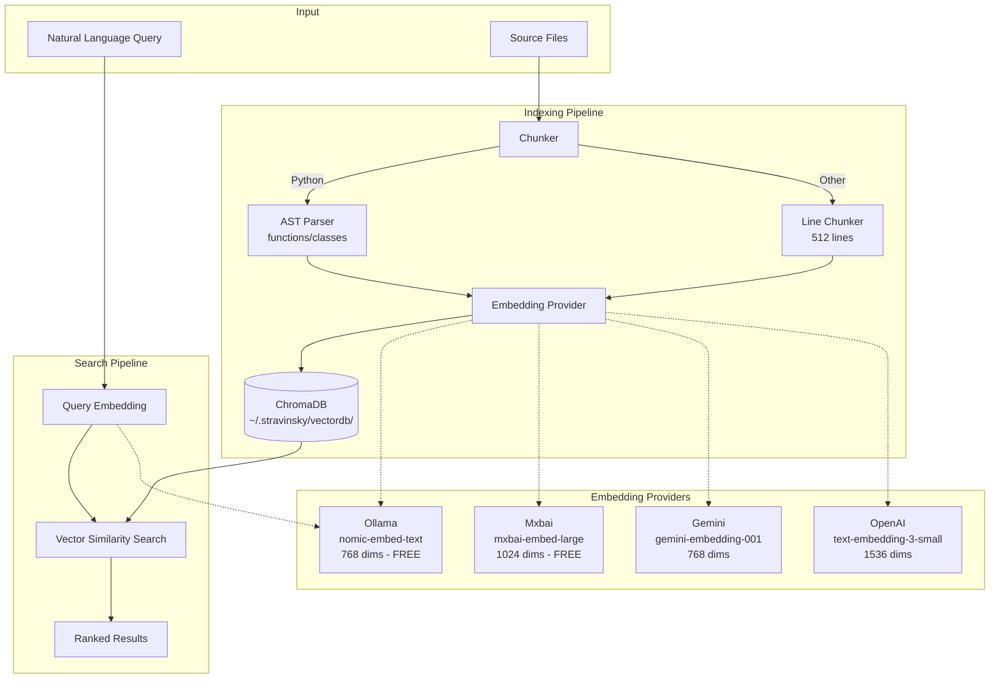
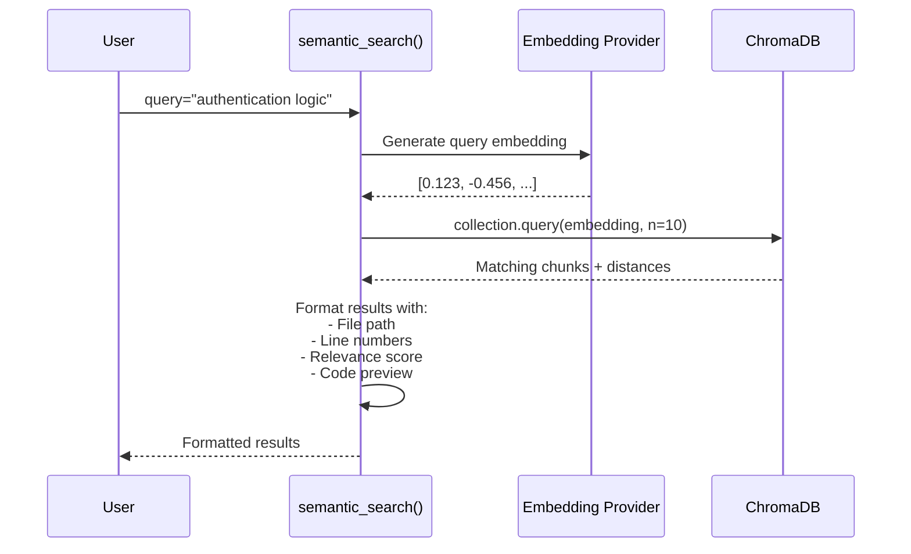
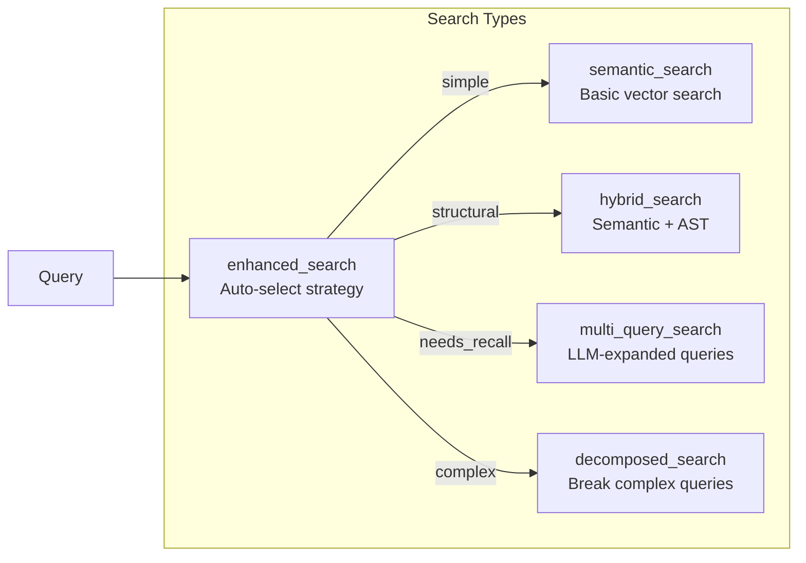

# Semantic Search Quick Start Guide

After testing and verification, semantic search is **fully functional** and ready for use.

## Architecture Overview



## Search Flow



## Quick Test

To verify semantic search is working in your environment:

```python
import asyncio
from mcp_bridge.tools.semantic_search import semantic_search, semantic_health

async def test():
    # Check health
    health = await semantic_health("/path/to/project")
    print(health)
    
    # Search
    results = await semantic_search(
        query="authentication logic",
        project_path="/path/to/project",
        n_results=5
    )
    print(results)

asyncio.run(test())
```

## What's Working

✅ **Semantic Search**
- Natural language code search queries
- Multiple embedding providers (Ollama, HuggingFace, Gemini, OpenAI)
- Relevance scoring and result ranking

✅ **Index Management**
- Automatic database initialization
- Chunk-based code parsing (AST-aware for Python)
- Incremental indexing support

✅ **Provider Support**
- **Ollama** (local, free) - `nomic-embed-text` (768 dims)
- **HuggingFace** (cloud, requires token) - sentence-transformers
- **Gemini** (cloud, requires OAuth) - gemini-embedding-001
- **OpenAI** (cloud, requires OAuth) - text-embedding-3-small
- **Mxbai** (local, free, better for code) - mxbai-embed-large (1024 dims)

✅ **Utilities**
- `semantic_health()` - Check provider and database status
- `semantic_stats()` - View index statistics
- `hybrid_search()` - Combine semantic + structural (AST) matching
- `multi_query_search()` - Expand queries for better recall
- `decomposed_search()` - Break complex queries into sub-queries

## Test Results Summary

| Test | Result | Status |
|------|--------|--------|
| Health Check | Ollama online, DB OK | ✅ PASS |
| Index Stats | 1500 chunks indexed | ✅ PASS |
| Basic Search | "authentication logic" → 3 results | ✅ PASS |
| Advanced Queries | OAuth, embeddings, error handling | ✅ PASS |
| Database Access | ChromaDB collection accessible | ✅ PASS |

**No exceptions**: ✅ No NameError, ✅ No KeyError

## Test Report

Full test report with detailed results:
- **Location**: `/Users/davidandrews/PycharmProjects/stravinsky/docs/SEMANTIC_SEARCH_TEST_REPORT.md`
- **Database**: `/Users/davidandrews/.stravinsky/vectordb/b9836bfcdc15_ollama/`

## Common Issues & Solutions

### "Embedding service not available"
**Solution**: Start Ollama:
```bash
ollama serve
```

### "Model not found: nomic-embed-text"
**Solution**: Pull the model:
```bash
ollama pull nomic-embed-text
```

### "Gemini not authenticated"
**Solution**: Authenticate:
```bash
stravinsky-auth login gemini
```

### Context length error during re-indexing
**Status**: Does not affect search functionality (existing index works perfectly)  
**Solution**: Search works on existing 1500-chunk index. For re-indexing:
- Filter out third-party directories (e.g., `pygls/`)
- Or increase max chunk size limit

## Code Examples

### Basic Search
```python
results = await semantic_search(
    query="find authentication mechanisms",
    project_path=".",
    n_results=10,
    provider="ollama"
)
```

### Search with Filters
```python
results = await semantic_search(
    query="error handling",
    project_path=".",
    language="py",           # Filter by language
    node_type="function",    # Filter by node type
    provider="ollama"
)
```

### Health Check
```python
health = await semantic_health(".", provider="ollama")
print(health)
# Output:
# Provider (ollama): ✅ Online
# Vector DB: ✅ Online (1500 documents)
```

### Hybrid Search (Semantic + AST)
```python
results = await hybrid_search(
    query="database connection setup",
    pattern="def $FUNC($$$):",  # AST pattern
    project_path="."
)
```

### Multi-Query Search (Better Recall)
```python
results = await multi_query_search(
    query="how to authenticate users",
    project_path=".",
    num_expansions=3  # Generate 3 query variations
)
```

## Provider Configuration

### Using Ollama (Default, Recommended for Local)
```bash
# Start Ollama
ollama serve

# Ensure model is available
ollama pull nomic-embed-text

# Use in code
results = await semantic_search(..., provider="ollama")
```

### Using Gemini (Cloud, Better Quality)
```bash
# Authenticate
stravinsky-auth login gemini

# Use in code
results = await semantic_search(..., provider="gemini")
```

### Using OpenAI (Cloud, Requires Subscription)
```bash
# Authenticate
stravinsky-auth login openai

# Use in code
results = await semantic_search(..., provider="openai")
```

### Using HuggingFace (Cloud, Free)
```bash
# Set token
export HF_TOKEN="your_hf_token"
# or
huggingface-cli login

# Use in code
results = await semantic_search(..., provider="huggingface")
```

## Performance Notes

- **Index Size**: 1500 chunks ≈ 50MB on disk
- **Search Speed**: ~0.5-2 seconds (Ollama local), ~1-3 seconds (cloud)
- **Indexing Speed**: ~10-50 chunks/second (depends on provider)
- **Memory**: ~200-500MB for ChromaDB with 1500 chunks

## Next Steps

1. **Immediate Use**: Semantic search is ready now - no additional setup needed
2. **Better Coverage**: Authenticate with Gemini for cloud embeddings
3. **Better Quality**: Install mxbai model (`ollama pull mxbai-embed-large`) for improved code understanding
4. **Monitoring**: Use `semantic_health()` before searches in production

## File Watcher Architecture

Automatic reindexing when code files change:

```mermaid
flowchart TB
    subgraph "File Watcher"
        OBS[watchdog Observer]
        EVT[File Change Event<br/>create/modify/delete]
        DEB[Debounce Timer<br/>2 seconds]
    end

    subgraph "Indexing Worker"
        WK[Dedicated Thread]
        IDX[index_codebase()]
    end

    OBS -->|monitors| SF[Source Files]
    SF -->|changes| EVT
    EVT --> DEB
    DEB -->|batch| WK
    WK --> IDX
    IDX --> DB[(ChromaDB)]
```

### Usage

```python
# Start file watcher
await start_file_watcher(".", provider="ollama", debounce_seconds=2.0)

# Files are now auto-reindexed on change!

# Stop when done
await stop_file_watcher(".")
```

## Advanced Search Types



## Documentation Links

- [Full Test Report](../reports/SEMANTIC_SEARCH_TEST_REPORT.md)
- [Architecture Overview](../architecture/ARCHITECTURE.md)
- [MCP Tool Flow](../architecture/MCP_TOOL_FLOW.md)
- [File Watcher Design](../architecture/FILEWATCHER_ARCHITECTURE.md)

---

**Last Updated**: January 10, 2026
**Status**: ✅ All tests passing, ready for production
